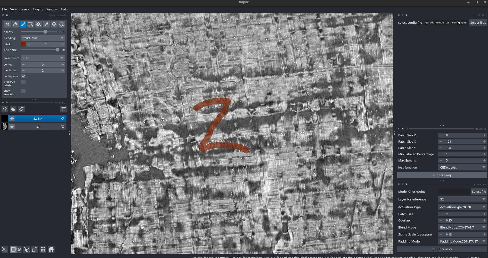
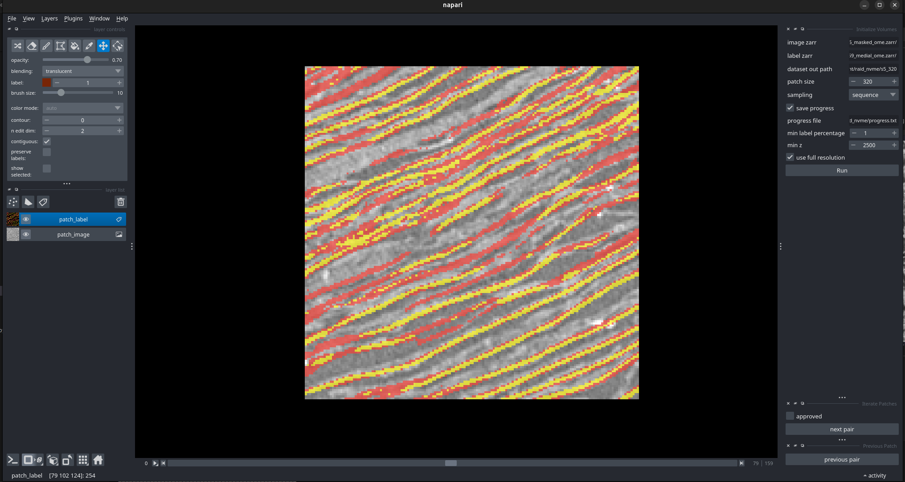

# vesuvius
From [Vesuvius Challenge](https://scrollprize.org), a Python library for : 
- Accessing CT data of Herculaneum Scrolls
- Training 2d or 3d semantic segmentation models, with support for multi-task and multi-class
- Training 2d or 3d models on regression tasks
- Inferring with models trained with the trainers provided in the package or with pretrained nnUNetv2 models
  - Inference can be performed on remote data (http, s3) stored as Zarr arrays
- Voxelizing large .obj segmentations for use as 3d labels
- Preprocessing labels of fiber-like structures
- Interactive labeling and model training through a Napari based trainer
- Proofreading large arrays of image/label pairs and saving approved chunks
- Computing structure tensors on large Zarr arrays, and deriving eigenvalues and eigenvectors from them

`vesuvius` also comes prepackaged with: 
- extensive data augmentation
- Dataset orchestrator with streaming adapters for image (tif/png/jpg), zarr, and napari-backed sources

_this package is in active development_


### Entrypoints: 

| Name                            | Script                               | Description                                                                                                                                                                                               |
| ------------------------------- | ------------------------------------ | --------------------------------------------------------------------------------------------------------------------------------------------------------------------------------------------------------- |
| `vesuvius.accept_terms`         | `install.accept_terms`               | accepts the data usage terms and conditions (required once before accessing the data)                                                                                                                     |
| `vesuvius.predict`              | `models.run.inference`               | outputs logits from a pretrained nnUNet-v2 model or one trained within the Vesuvius training framework; currently only works on Zarr data and can be fully distributed with `--num_parts` and `--part_id` |
| `vesuvius.blend_logits`         | `models.run.blending`                | blends the logits from `vesuvius.predict` using Gaussian blending                                                                                                                                         |
| `vesuvius.blend_and_finalize`   | `models.run.blending`                | blends partial inference outputs and finalizes (softmax + `uint8`) in a single pass                                                                                                                       |
| `vesuvius.finalize_outputs`     | `models.run.finalize_outputs`        | performs softmax / argmax / none on the blended array and writes a final `uint8` volume                                                                                                                   |
| `vesuvius.compute_st`           | `structure_tensor.run_create_st`     | computes structure tensors on input data and derives eigen-values/vectors                                                                                                                                 |
| `vesuvius.napari_trainer`       | `napari_trainer.main_window`         | launches a Napari window for interactive training and inference                                                                                                                                           |
| `vesuvius.voxelize_obj`         | `image_proc.run.voxelize_objs`       | converts input `.obj` meshes to voxel grids and outputs `.tif` stacks                                                                                                                                     |
| `vesuvius.refine_labels`        | `image_proc.run.edt_frangi_label`    | refines surface or fibre labels with a custom Frangi-based filter                                                                                                                                         |
| `vesuvius.train`                | `models.training.train`              | main entry point for training models                                                                                                                                                                      |
| `vesuvius.zarr_tasks`           | `image_proc.run.zarr_tasks`          | operates on zarr arrays with various tasks                                                                                                                                                                |
| `vesuvius.find_patches`         | `models.preprocessing.patches.cli`   | generates per-volume patch caches for a dataset                                                                                                                                                           |

> **Note:** the previously documented `vesuvius.render_obj` and `vesuvius.flatten_obj` entrypoints no longer exist — that code was retired with ThaumatoAnakalyptor (now under `deprecated/`). To render a segment into a surface volume, use `vc_render_tifxyz` from [volume-cartographer](../volume-cartographer). The proofreader still exists but is no longer part of this package: it lives at [`segmentation/vc_proofreader`](../segmentation/vc_proofreader) (see [Proofreading labels](#proofreading-labels) below).


## 📓 Introductory notebooks
To get started, we recommend these notebooks that jump right in:

1. 📊 [Scroll Data Access](https://colab.research.google.com/github/ScrollPrize/villa/blob/main/vesuvius/src/vesuvius/examples/notebooks/example1_data_access.ipynb): an introduction to accessing scroll data using a few lines of Python!

2. ✒️ [Ink Detection](https://colab.research.google.com/github/ScrollPrize/villa/blob/main/vesuvius/src/vesuvius/examples/notebooks/example2_ink_detection.ipynb): load and visualize segments with ink labels, and train models to detect ink in CT.

3. 🧩 [Volumetric instance segmentation cubes](https://colab.research.google.com/github/ScrollPrize/villa/blob/main/vesuvius/src/vesuvius/examples/notebooks/example3_cubes_bootstrap.ipynb): how to access instance-annotated cubes with the `Cube` class, used for volumetric segmentation approaches.

## `vesuvius` does:
- **Data retrieval**: Fetches volumetric scroll data, surface volumes of scroll segments, and annotated volumetric instance segmentation labels. Remote repositories and local files are supported.
- **Data listing**: Lists the available data on [our data server](https://dl.ash2txt.org).
- **Data caching**: Caches fetched data to improve performance when accessing remote repositories.
- **Normalization**: Provides options to normalize data values.
- **Multiresolution**: Accesses and manages data at multiple image resolutions.

## `vesuvius` doesn't do:
- **Remote data modification**: The read-only library does not support modifying the original data.
- **Complex analysis**: While it provides access to data, it does not include built-in tools for complex data analysis or visualization.

## Installation

`vesuvius` can be installed with `pip`.
Then, before using the library for the first time, accept the license terms:
```sh
$ pip install vesuvius
$ vesuvius.accept_terms --yes
```

___
**Note:** 

The model framework utilized by `vesuvius` is _heavily_ inspired by [nnUNetv2](https://github.com/MIC-DKFZ/nnUNet). The default configuration will use the same blocks and construct the same encoders/decoders as the default nnUNetv2 ResEncUNet. As such, a significant portion of the code from the nnUNetv2 repository is duplicated here, with modifications to enable multi-task support with dynamic decoder branches, as well as other data formats. 

Additionally, the augmentations provided within this package are from another of [MIC-DKFZ's](https://github.com/MIC-DKFZ) fantastic array of machine learning libraries, in this case [batchgeneratorsv2](https://github.com/MIC-DKFZ/batchgeneratorsv2). 

Copying the modules directly into `vesuvius` was a choice of end-user friendliness, as we were using highly modified branches of both libraries, which created conflicts if an end user were to attempt to run any of our models.

_**Detailed documentation for training and inference are located in [the docs folder](docs)**_
___


### Napari based training

1. Run `vesuvius.napari_trainer`
2. Add an image to the viewer
3. Add a label layer, with the suffix as the name of your target (ex : `32_ink`)
4. Optionally, add a label layer with the suffix `_mask` (ex : `32_mask`)
5. Set your training configuration and hit `run training`
6. Infer on the same layer, or another by importing an image, selecting it in the inference widget, and hitting `Run Inference`




___

### Proofreading labels

The proofreader lives in [`segmentation/vc_proofreader`](../segmentation/vc_proofreader) (it is not part of the `vesuvius` package).

1. Write a config file (JSON, or a Python script defining a `config` dict) with the proper paths
2. Run `python segmentation/vc_proofreader/main.py --config <your config>` from the repo root
3. Select your desired patch size and min labeled percentage 
4. Click `run` 
5. Approve patches with `a` or by checking the box
6. Skip patches or continue with `spacebar` or `next pair`
7. Patches are saved in the output dir, and their locations in the .json progress file



### Training with `vesuvius.train`

Supported model types:
- Single task, single class semantic segmentation / regression
- Single task, multi-class semantic segmentation / regression
- Multi-task, single-class semantic segmentation / regression
- Multi-task, multi-class semantic segmentation / regression

By default, when provided with a single channel (binary) input label, the model will output 2 channels (fg/bg), but can adapt to any number of input channels.

**Place your data in the following format:** 
```
data/
  images/
    volume1.zarr (or .tif, .png, .jpg)
    volume2.zarr
  labels/
    volume1_ink.zarr (or tif, .png, .jpg) 
    volume1_hz_fiber.zarr ( if you want an additional task for the same volume )
    volume2_ink.zarr
   ```
**Begin training with:**
```bash
 vesuvius.train -i /path/to/data --batch-size 4 --patch-size 128,128,128 --model-name /path/to/save/checkpoints --config-path /vesuvius/models/configuration/multi-task_config.yaml
```
There are a number of other optional parameters, which you can find with `--help`

When this command is run: 
- a ConfigManager class will be instantiated, which will take the arguments given and the configuration file, and store these as properties.
- The trainer class will execute its class method `__build_model`, which will create an instance of `NetworkFromConfig`
- `NetworkFromConfig` will dynamically determine the number of pooling operations, stages, feature map sizes, operation dimensionality, and other specified parameters
- The trainer class will execute its `_configure_dataset` method, instantiating the `DatasetOrchestrator` with the adapter that matches `data_format`
- The trainer class will execute the rest of the setup required for training, through the following additional class methods:
  - `_build_loss`
  - `_get_optimizer`
  - `_get_scheduler`
  - `_get_scaler`
  - `_configure_dataloaders`

- The training loop will begin

Training will output the current losses in the `tqdm` progress bar, and will save a "debug" png or gif (depending on dimensionality) in the checkpoint directory. 

By default, the last 10 checkpoints are saved. This is not a smart way to do it, and will be changed to just store the last 3 + last 2 best validation. 

Training will run for 1,000 epochs by default, with 200 batches/epoch. This can be modified through the configuration file, which can be optionally provided to `vesuvius.train`, and some examples are provided in the [models folder](src/vesuvius/models/configuration/)

### Rendering and Flattening objs
This code was retired with ThaumatoAnakalyptor (now under [`deprecated/`](../deprecated/thaumato-anakalyptor)). To render a segment into a surface volume, use `vc_render_tifxyz` from [volume-cartographer](../volume-cartographer).
