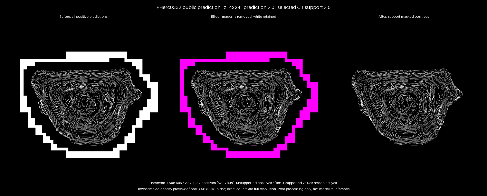

# Inference Pipeline Overview

The Vesuvius tooling exposes three command-line stages plus a convenience orchestrator:

1. `vesuvius.predict` — run a trained model and write patch logits.
2. `vesuvius.blend_logits` — merge overlapping patches with Gaussian weighting.
3. `vesuvius.finalize_outputs` — convert logits into probabilities or masks and build a multiscale Zarr.

All commands honour local paths and remote storage backed by `fsspec` (for example S3). Run `vesuvius.accept_terms --yes` before accessing remote scroll volumes.

## Stage 1 — `vesuvius.predict`

`vesuvius.predict` loads a checkpoint (nnU-Net v2 compatible or a `vesuvius.train` checkpoint) and produces tiled logits. It supports distributed execution by splitting the volume into `num_parts` and assigning each process a unique `part_id`.

```bash
vesuvius.predict \
  --model_path /path/to/model \
  --input_dir /path/to/input.zarr \
  --output_dir /tmp/logits \
  --num_parts 4 \
  --part_id 0 \
  --device cuda:0
```

### Key Arguments

| Argument | Description |
|----------|-------------|
| `--model_path` (required) | Path to a model directory, a `.pth` checkpoint, or `hf://` repository.
| `--input_dir` (required) | Volume input: Zarr root, TIFF stack, or a directory understood by the `Volume` helper.
| `--output_dir` (required) | Destination folder for logits (`logits_part_{id}.zarr`) and coordinates.
| `--input_format` | Force `zarr`, `tiff`, or `volume` detection. Usually optional.
| `--tta_type` / `--disable_tta` | Choose `rotation` (default) or `mirroring`, or disable test-time augmentation.
| `--num_parts` / `--part_id` | Partition inference so multiple machines can process different chunks.
| `--overlap` | Fractional patch overlap (0–1, default `0.5`).
| `--batch_size` | Inference batch size (default `1`).
| `--patch_size` | Override the model patch size using a comma-separated list (e.g. `192,192,192`).
| `--mode` | `binary`/`multiclass` (default segmentation) or `surface_frame` to keep 9-channel tangent frames.
| `--tif-activation` | When writing TIFF outputs, pick `softmax`, `argmax`, or `none`.
| `--save_softmax` | Legacy flag for saving softmax logits (consider `--tif-activation`).
| `--normalization` | Runtime normalization (`instance_zscore`, `global_zscore`, `instance_minmax`, `ct`, `none`).
| `--intensity-properties-json` | nnU-Net style JSON with intensity stats for CT normalization.
| `--device` | Device string such as `cuda`, `cuda:1`, or `cpu`.
| `--skip-empty-patches` / `--no-skip-empty-patches` | Toggle automatic removal of homogeneous patches.
| `--zarr-compressor` / `--zarr-compression-level` | Configure output compression (`zstd` with level `3` by default).
| `--scroll_id`, `--segment_id`, `--energy`, `--resolution` | Metadata when reading remote scrolls via the `Volume` helper.
| `--hf_token` | Hugging Face token for private repositories.
| `--config-yaml` | Training YAML to resolve model architecture when the checkpoint lacks embedded metadata.
| `--verbose` | Print detailed progress information.

Distributed execution simply repeats the command with different `part_id` values. All workers must share the same `output_dir`:

```bash
# machine 1
vesuvius.predict --model_path ... --num_parts 4 --part_id 0 --device cuda:0
# machine 2
vesuvius.predict --model_path ... --num_parts 4 --part_id 1 --device cuda:0
```

Each worker writes `logits_part_<id>.zarr` and `coordinates_part_<id>.zarr` into the output directory.

## Stage 2 — `vesuvius.blend_logits`

Combine the partial logits by weighting overlaps with a Gaussian window. The command scans the `parent_dir` for matching `logits_part_*.zarr` and `coordinates_part_*.zarr` pairs.

```bash
vesuvius.blend_logits /tmp/logits /tmp/merged_logits.zarr \
  --num_workers 16 \
  --chunk_size 256,256,256
```

### Options

| Argument | Description |
|----------|-------------|
| `parent_dir` | Folder containing the per-part logits and coordinates Zarr stores.
| `output_path` | Destination Zarr for the merged logits.
| `--sigma_scale` | Controls Gaussian falloff (`patch_size / sigma_scale`, default `8.0`).
| `--chunk_size` | Spatial chunk size (`Z,Y,X`) for the merged Zarr. Leave unset to auto-pick.
| `--num_workers` | Number of worker processes. Defaults to `CPU_COUNT - 1`.
| `--compression_level` | Zarr compression level (0–9, default `1`).
| `--quiet` | Suppress verbose logging.

The merged logits retain the same class/channel dimension as the individual parts.

## Stage 3 — `vesuvius.finalize_outputs`

Finalize logits into probabilities or masks and optionally build a multiscale pyramid. The command writes OME-NGFF metadata and (when requested) deletes the intermediate logits directory.

```bash
vesuvius.finalize_outputs /tmp/merged_logits.zarr /tmp/final_output.zarr \
  --mode binary \
  --threshold --threshold-value 0.3 \
  --delete-intermediates
```

`--threshold` toggles binarization on (default cutoff `0.5`). `--threshold-value T` overrides the cutoff with any value in `(0, 1)` and requires `--threshold`. The right cutoff is model-dependent and should come from validation — `0.3` above is illustrative, not a recommendation.

### Options

| Argument | Description |
|----------|-------------|
| `input_path` | Path to the blended logits Zarr (level `0` is the logits array).
| `output_path` | Destination multiscale Zarr root.
| `--mode` | `binary` (default), `multiclass`, or `surface_frame` (keeps 9-channel frame outputs; no thresholding).
| `--threshold` | Binarize the probability map. In `binary` mode cuts at the probability given by `--threshold-value` (default `0.5`). In `multiclass` mode emits the argmax channel. Ignored in `surface_frame` mode.
| `--threshold-value T` | Override the `--threshold` cutoff with `T` in `(0, 1)`. Requires `--threshold`. Binary mode only — rejected in `multiclass` since argmax ignores the cutoff.
| `--support-volume PATH` | Mask finalized binary predictions with an exactly aligned 3-D support Zarr array (or a singleton-channel 4-D array).
| `--support-threshold T` | Treat support values `<= T` as background (default `0`). Requires `--support-volume` when set to a non-default value.
| `--support-authenticated` | Use configured credentials for an S3 support volume. Public S3 access is anonymous by default.
| `--delete-intermediates` | Remove the source logits after a successful run.
| `--chunk-size` | Spatial chunk size for the output store (`Z,Y,X`). Defaults to the logits chunking.
| `--num-workers` | Worker processes for finalization (defaults to half of CPU cores).
| `--quiet` | Suppress verbose logging.

Without `--threshold`, binary mode outputs a single softmax foreground channel; multiclass mode writes one channel per class plus an argmax channel. `surface_frame` mode bypasses thresholding entirely and stores orthonormal 9-channel frames in float32.

### Optional CT/support masking

`vesuvius.finalize_outputs` and the fused `vesuvius.blend_and_finalize` command share the three support-mask options above. This feature is opt-in and currently supports only `--mode binary`. `--support-volume` must point directly to a Zarr array with spatial shape `(Z,Y,X)` exactly matching the output grid; a `(1,Z,Y,X)` singleton-channel array is also accepted. For an OME-Zarr pyramid, include the aligned resolution level in the path. The command validates rank and shape; the caller must verify that both arrays represent the same physical scan, axes, resolution level, and coordinate transform.

The support mask is applied after softmax and optional prediction thresholding. A voxel remains supported only when its support value is finite and greater than `--support-threshold`; all output values at other voxels are set to background. Public `s3://` support volumes use anonymous access by default. Add `--support-authenticated` only when the support array requires configured AWS credentials.

#### Relation to inference-time masking

For future binary inference, unsupported voxels can also be encoded as strong background logits while the raw input patch is already in memory; simply setting equal binary logits to zero would yield foreground probability `0.5`. [PR #1173](https://github.com/ScrollPrize/villa/pull/1173) explores that source-side prevention layer. It is complementary to final-stage masking: source prevention affects new runs and must respect each target's output semantics, while the support-volume path here is applied after Gaussian blending and probability conversion, can use a separate thresholded support array, records output provenance and statistics, and can repair existing finalized predictions.

For example, [issue #1114](https://github.com/ScrollPrize/villa/issues/1114) compares this public PHerc0332 prediction level:

```text
s3://vesuvius-challenge-open-data/PHerc0332/representations/predictions/surfaces/20251211183505-surface-20260413222639-surface-m7-L2-th0.2.zarr/0
```

with level `2` of the aligned masked CT volume; both have shape `(8398,3941,3941)`. To reproduce that artifact from its merged logits while removing voxels where the masked CT is `<= 5`:

```bash
vesuvius.finalize_outputs /path/to/PHerc0332-merged-logits.zarr /path/to/final.zarr \
  --mode binary \
  --threshold --threshold-value 0.2 \
  --support-volume s3://vesuvius-challenge-open-data/PHerc0332/volumes/20251211183505-2.399um-0.2m-78keV-masked.zarr/2 \
  --support-threshold 5
```

The same mask can be applied without writing merged logits first:

```bash
vesuvius.blend_and_finalize /path/to/partial-logits /path/to/final.zarr \
  --mode binary \
  --threshold --threshold-value 0.2 \
  --support-volume s3://vesuvius-challenge-open-data/PHerc0332/volumes/20251211183505-2.399um-0.2m-78keV-masked.zarr/2 \
  --support-threshold 5
```

Masked runs record `support_mask_applied`, the support path, threshold, and access mode in the output Zarr attributes. They also print the number and fraction of nonzero predictions removed. Single-part runs store those metrics in `support_mask_stats`; its scope is explicitly marked as chunks with nonempty finalized output.

### Repair an existing finalized prediction

Use `vesuvius.mask_predictions` when the prediction already exists, including
published 3-D or singleton-channel binary Zarr arrays. It writes a masked copy,
preserves supported values and source attributes, and records an exact
artifact-wide phantom fraction over all nonzero input predictions:

Install the package with its `blending` extra before using this command. When
prediction and support chunks differ, its default work/output chunk is a
memory-bounded common multiple (384³ for the 192³ prediction and 128³ CT in the
example), avoiding repeated reads across mismatched chunk boundaries.

```bash
vesuvius.mask_predictions \
  s3://vesuvius-challenge-open-data/PHerc0332/representations/predictions/surfaces/20251211183505-surface-20260413222639-surface-m7-L2-th0.2.zarr/0 \
  /data/PHerc0332-surface-m7-supported.zarr \
  --support-volume s3://vesuvius-challenge-open-data/PHerc0332/volumes/20251211183505-2.399um-0.2m-78keV-masked.zarr/2 \
  --support-threshold 5 \
  --num-workers 8
```

Public S3 inputs are anonymous by default. Use `--authenticated-inputs` only
for private prediction or support arrays. The output path must not replace
or contain either input (and vice versa). This command writes one plain Zarr
array, not an OME multiscale root. Before publishing it as a drop-in
replacement, regenerate the pyramid and root metadata while copying the
support-mask provenance and statistics to the published root. Pyramid
regeneration is deliberately outside this single-array command.

To audit an already-finalized artifact without writing a corrected full volume,
stream only selected planes with the bundled benchmark:

```bash
uv run --extra blending python -m vesuvius.models.benchmarks.benchmark_support_mask \
  s3://vesuvius-challenge-open-data/PHerc0332/representations/predictions/surfaces/20251211183505-surface-20260413222639-surface-m7-L2-th0.2.zarr/0 \
  s3://vesuvius-challenge-open-data/PHerc0332/volumes/20251211183505-2.399um-0.2m-78keV-masked.zarr/2 \
  --planes 2000 4224 6000 \
  --support-threshold 5 \
  --output-json docs/benchmarks/support_mask/PHerc0332-three-planes.json \
  --image-plane 4224 \
  --output-image docs/images/support_mask_pherc0332_z4224_before_after.png \
  --image-label "PHerc0332 public prediction"
```

The JSON report includes per-plane and aggregate phantom-positive fractions,
removed voxel counts, supported-value preservation, elapsed time, and source
array metadata. It materializes only one prediction/support plane pair at a
time. `logical_plane_bytes` is the in-memory NumPy payload; the separate
intersecting-chunk upper bound describes uncompressed 3-D chunk payload and is
not a claim about compressed network transfer.

The optional image uses the same uncropped plane and fixed scaling in all three
panels. It is a downsampled density preview only; the displayed counts are
computed at full resolution. Magenta marks positive predictions removed outside
the selected CT support, and white marks retained positives. This demonstrates
post-processing of the published prediction, not model re-inference or a claim
of full-volume validation.



The checked-in raw reports make the counts and exact public inputs independently
auditable:

- [PHerc0332 planes 2000, 4224, and 6000](benchmarks/support_mask/PHerc0332-three-planes.json)
- [PHerc1451 plane 7493](benchmarks/support_mask/PHerc1451-plane-7493.json)

The PHerc1451 report can be regenerated with:

```bash
uv run --extra blending python -m vesuvius.models.benchmarks.benchmark_support_mask \
  s3://vesuvius-challenge-open-data/PHerc1451/representations/predictions/surfaces/20260319101107-surface-20260413222639-surface-m7-L2-th0.2.zarr/0 \
  s3://vesuvius-challenge-open-data/PHerc1451/volumes/20260319101107-2.399um-0.2m-78keV-masked.zarr/2 \
  --planes 7493 \
  --support-threshold 5 \
  --output-json docs/benchmarks/support_mask/PHerc1451-plane-7493.json
```

## Full Remote Workflow Example

```bash
# 1. Run prediction on four machines (part IDs 0–3)
vesuvius.predict --model_path hf://scrollprize/surface_recto \
    --input_dir s3://vesuvius/input/Scroll1.zarr \
    --output_dir s3://vesuvius/tmp/logits \
    --num_parts 4 \
    --part_id 0 \
    --device cuda:0 \
    --zarr-compressor zstd \
    --zarr-compression-level 3 \
    --skip-empty-patches

# ...repeat for part_id 1,2,3 on other hosts...

# 2. Blend logits once all parts finish
vesuvius.blend_logits s3://vesuvius/tmp/logits s3://vesuvius/tmp/merged_logits.zarr \
    --num_workers 32 \
    --chunk_size 256,256,256

# 3. Finalize outputs (bare --threshold cuts at 0.5; add --threshold-value 0.3 for a different cutoff)
vesuvius.finalize_outputs s3://vesuvius/tmp/merged_logits.zarr s3://vesuvius/output/final.zarr \
    --mode binary \
    --threshold \
    --delete-intermediates
```

After finalization the destination Zarr contains a multiscale hierarchy (`0/`, `1/`, …) and a `metadata.json` file describing the inference run. Rechunk the output if you plan to serve it through a viewer that expects different chunk sizes.
