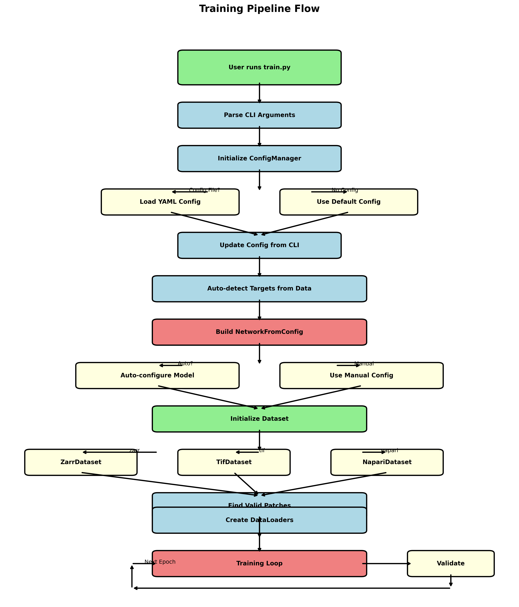
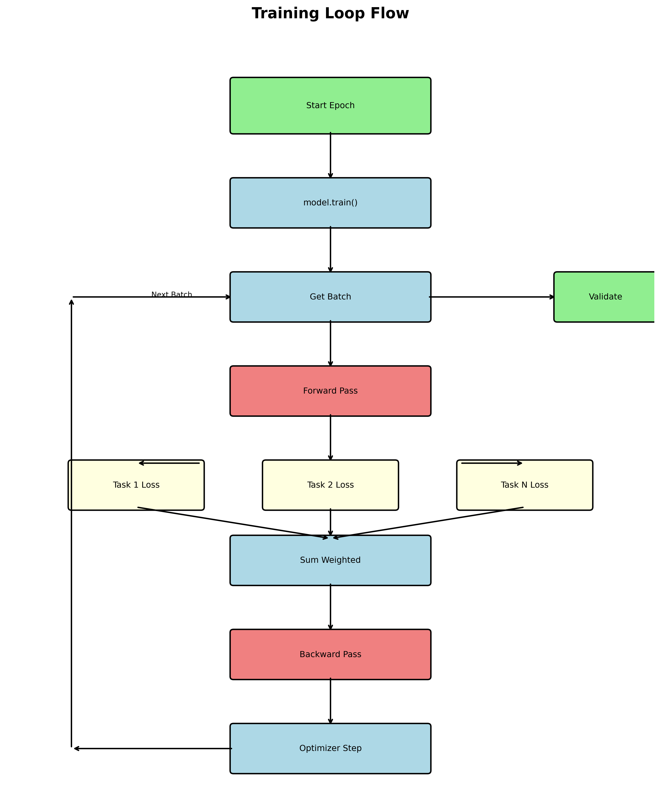

# Training Flow Documentation: From Script to Model

This document provides a comprehensive overview of the training pipeline, from initial script execution through model training and checkpoint saving.

Note that significant portions of this pipeline were borrowed/inspired by [dynamic-network-architectures](https://github.com/MIC-DKFZ/dynamic-network-architectures) and [nnUNetv2](https://github.com/MIC-DKFZ/nnUNet), both from the Division of Medical Image Computing, German Cancer Research Center (DKFZ). Their work is very much appreciated and has been the foundation from which i've learned anything at all about machine learning. I'd highly recommend checking out any of their repositories. 

## Table of Contents
1. [High-Level Training Flow](#high-level-training-flow)
2. [Entry Point: Training Script](#entry-point-training-script-initialization)
3. [Configuration Management](#configuration-management)
4. [Model Architecture Building](#model-architecture-building)
5. [Dataset Pipeline](#dataset-pipeline)
6. [Training Loop](#training-loop)
7. [Key Features](#key-features-and-design-patterns)
8. [Error Handling](#error-handling-and-validation)
9. [Output and Results](#output-and-results)
10. [Auxiliary Tasks](#auxiliary-tasks)

## High-Level Training Flow




## 1. Entry Point: Training Script Initialization

### 1.1 Command Line Entry (`train.py`)
The training process begins when the user executes the training script:

```bash
python train.py -i /path/to/data -o /path/to/checkpoints 
```

### 1.2 Argument Processing
- **Required arguments**:
  - `-i/--input`: Data directory containing `images/`, `labels/`, and optionally `masks/` subdirectories
  - `-o/--output`: Output directory for checkpoints and configurations
  - `--format`: Data format (zarr, tif, or napari)
  
- **Optional arguments**:
  - `--batch-size`: Training batch size
  - `--patch-size`: Patch dimensions (e.g., "192,192,192" for 3D)
  - `--loss`: Loss functions as list or comma-separated
  - `--train-split`: Training/validation split ratio
  - `--loss-on-label-only`: Compute loss only on labeled regions
  - `--config-path`: Path to YAML configuration file

## 2. Configuration Management

### 2.1 ConfigManager Initialization

The `ConfigManager` class serves as the central configuration hub:

1. **Load Configuration**:
   - If `--config-path` provided: Load from YAML file
   - Otherwise: Initialize with default values
   
2. **Configuration Structure**:
   ```yaml
   tr_setup:       # Training setup (model name, checkpoints, etc.)
   tr_config:      # Training parameters (lr, epochs, batch size)
   model_config:   # Model architecture settings
   dataset_config: # Dataset parameters
   inference_config: # Inference settings
   ```

3. **Dynamic Configuration Updates**:
   - Command-line arguments override config file values
   - Auto-detection of targets from data directory structure
   - Dimensionality detection (2D vs 3D) based on data

### 2.2 Target Configuration
Targets represent what the model predicts (e.g., ink detection, damage segmentation):

```python
targets = {
    "ink": {
        "out_channels": 1,
        "activation": "sigmoid",
        "losses": [
            {
                "name": "SoftDiceLoss",
                "weight": 1.0,
                "kwargs": {}
            }
        ]
    },
    "damage": {
        "out_channels": 1,
        "activation": "sigmoid",
        "losses": [
            {
                "name": "BCEWithLogitsLoss",
                "weight": 1.0,
                "kwargs": {}
            }
        ]
    }
}
```

## 3. Model Architecture Building

### 3.1 Auto-configuration Process

The `NetworkFromConfig` class builds a flexible U-Net architecture:

1. **Auto-configuration Mode** (if enabled):
   - Analyzes patch size and spacing
   - Calculates optimal pooling operations
   - Determines number of stages and features per stage
   - Adjusts patch size for divisibility requirements

2. **Architecture Components**:
   - **Shared Encoder**: Processes input through downsampling stages
   - **Task-specific Decoders**: One decoder per target
   - **Activation Functions**: Applied per task (sigmoid, softmax, none)

3. **Dimensionality Handling**:
   - Automatically selects 2D or 3D operations based on patch size
   - Conv2D/Conv3D, MaxPool2D/MaxPool3D, etc.

### 3.2 Architecture Decision Flow

The model is built by the NetworkFromConfig class, which determines the network architecture based on input characteristics:


#### Pooling Operation Determination

The pooling decision algorithm follows these steps:

1. **Initialize** with current spacing and patch size
2. **Iteratively check** for each potential pooling operation:
   - **Size constraint**: Can we downsample by 2x and maintain minimum feature map size?
   - **Spacing ratio**: Is the current spacing less than 2x the minimum spacing?
   - **Max operations**: Have we reached the maximum number of pooling operations?
3. **Update parameters** when valid axes are found:
   - Double the spacing for pooled axes
   - Halve the patch size
   - Record pooling kernel sizes
4. **Finalize patch size** to ensure divisibility by 2^(num_pool_per_axis)

#### Stage and Feature Configuration

- **Number of stages** = Number of pooling operations + 1
- **Blocks per stage**:
  - Stage 0: 1 block
  - Stage 1: 3 blocks
  - Stage 2: 4 blocks
  - Stage 3+: 6 blocks each
- **Features per stage**: min(base_features × 2^i, max_features)
  - Default: base_features = 32, max_features = 320

### 3.3 Adaptive Channel Configuration

The model supports flexible input/output channel configurations:


#### Input Channel Detection

Input channels are determined from (in order of priority):
1. ConfigManager.in_channels setting
2. Automatic detection from dataset
3. Default: 1 channel

#### Output Channel Configuration

For each task, output channels are determined by:
- If task specifies `channels` or `out_channels`: Use specified value
- Otherwise: Match input channels (adaptive behavior)

This allows for flexible configurations like:
```python
# 3-channel input example
targets = {
    "adaptive_task": {},                    # Outputs 3 channels (matches input)
    "fixed_task": {"channels": 1},         # Outputs 1 channel (specified)
    "multi_class": {"channels": 5}         # Outputs 5 channels (specified)
}
```

## 4. Dataset Pipeline

### 4.1 Dataset Pipeline Flow


### 4.2 Data Organization

Expected directory structure:
```
data_path/
├── images/
│   ├── image1.zarr/      # Shared across all targets
│   └── image2.zarr/
├── labels/
│   ├── image1_ink.zarr/  # Target-specific labels
│   ├── image1_damage.zarr/
│   └── ...
└── masks/                # Optional
    ├── image1_ink.zarr/  # Regions where loss is computed
    └── ...
```

### 4.3 Dataset Processing Flow

1. **Volume Initialization** (`_initialize_volumes`):
   - Loads data lazily
   - Groups data by target and image
   - Validates all configured targets have data

2. **Valid Patch Extraction** (`_get_valid_patches`):
   - Finds regions with sufficient labeled data
   - Uses masks if available, otherwise uses labels
   - Filters by `min_labeled_ratio` parameter
   - Stores patch coordinates for training

3. **Patch Retrieval** (`__getitem__`):
   - Get patch coordinates from valid_patches list
   - Extract image patch and normalize to [0,1]
   - Extract label patches for all targets
   - Extract loss mask if available
   - Apply augmentations (2D: albumentations, 3D: custom)
   - Convert to PyTorch tensors with proper dimensions
   - Return dictionary: {"image": tensor, "target1": tensor, ...}

### 4.4 Data Augmentation
- **2D Data**: Uses albumentations library
  - Synchronized transforms for image and all label masks
  - Configured in `compose_augmentations` function
  
- **3D Data**: Custom volume transformations
  - Currently limited to image-only transforms

## 5. Training Loop

### 5.1 Training Loop Flow



### 5.2 Training Components

1. **Optimizer Configuration**:
   - Default: AdamW with configurable learning rate
   - Alternative: SGD or other optimizers via config

2. **Loss Functions**:
   - Per-target loss functions
   - Masked losses (compute only on valid regions)
   - Weighted multi-task loss: `total_loss = Σ(weight_i * loss_i)`

3. **Learning Rate Scheduler**:
   - CosineAnnealingLR by default
   - Adjusts learning rate over epochs

## 6. Auxiliary Tasks

Auxiliary tasks let you add side objectives that are derived from a primary “source” target (e.g., distance transform or surface normals of a binary mask). They use the shared encoder with separate decoders and integrate into the same multi-task loss.

- Configuration: Add an `auxiliary_tasks` block to your YAML. Each entry must specify:
  - `type`: One of `distance_transform`, `surface_normals`.
  - `source_target`: The primary target name to derive from (e.g., `ink`, `surface`).
  - `losses`: List of losses and weights for the auxiliary head.
  - `loss_weight`: Optional overall weight for the task.
  - `out_channels`: Optional for `distance_transform` (defaults to 1); for `surface_normals` it is set automatically based on dimensionality (2 for 2D, 3 for 3D).

Example (excerpt):

```yaml
dataset_config:
  targets:
    surface:
      losses:
        - name: "BCEWithLogitsLoss"
          weight: 1.0

auxiliary_tasks:
  distance_transform:
    type: distance_transform
    source_target: surface
    loss_weight: 0.10
    losses:
      - name: "SignedDistanceLoss"
        weight: 1.0
        kwargs:
          rho: 6
          beta: 1
          eikonal: true

  surface_normals:
    type: surface_normals
    source_target: surface
    loss_weight: 0.10
    losses:
      - name: "CosineSimilarityLoss"
        weight: 1.0
        kwargs: { dim: 1 }
      - name: "NormalSmoothnessLoss"
        weight: 0.5
        kwargs: { sigma: 2.0, q: 2.0 }
```

How it works in code:
- Config injection: `ConfigManager` reads `auxiliary_tasks` and calls a small factory to append derived targets into `mgr.targets` with `auxiliary_task: true` and a reference to `source_target`.
- Dataset loading: Datasets only load label volumes for primary targets. Auxiliary targets do not require separate label files and are not looked up on disk.
- Loss computation: During training, losses are computed per key present in the batch label dict. The helper `compute_auxiliary_loss` passes `source_pred=outputs[source_target]` to losses that accept it. This enables:
  - Self-consistency/regularization losses that don’t need explicit GT (e.g., `NormalSmoothnessLoss` using only predicted normals with optional masking from `source_pred`).
  - Losses that need derived GT (e.g., `SignedDistanceLoss`, cosine loss on normals) when the batch provides the corresponding GT tensor.
  - For deep supervision, auxiliary targets default to `ds_interpolation: linear`, mapping to bilinear (2D) or trilinear (3D) in downsampling to preserve regression continuity.

Important notes and current behavior:
- The dataset now auto-generates ground-truth tensors for `distance_transform` (signed DT) and `surface_normals` per patch from the `source_target` labels, so related losses work out of the box.
- Auxiliary losses that are self-supervised or use only predictions (e.g., `NormalSmoothnessLoss`) also work and can be masked using `source_pred` passed through `compute_auxiliary_loss`.
- If you prefer, you can still precompute and store auxiliary labels on disk using the same naming convention; the dataset will ignore them unless you wire them explicitly.

This design allows mixing fully supervised targets with auxiliary/self-supervised regularizers and keeps disk I/O simple by deriving common auxiliary targets on the fly.

4. **Mixed Precision Training**:
   - GradScaler for CUDA devices
   - Automatic mixed precision 


### 5.3 Checkpoint Management
- Saves model weights, optimizer state, and configuration
- Keeps last 10 checkpoints
- Maintains single latest configuration file
- Model-specific directory: `checkpoints/model_name/`

## 6. Key Features and Design Patterns

### 6.1 Multi-Task Learning
- Single shared encoder extracts features
- Multiple decoders predict different targets if using multi-task
- Weighted loss combination

### 6.2 Flexible Data Handling
- Supports 2D and 3D data
- Multiple data formats (Zarr, TIFF, Napari)
- Optional masking for sparse labels

### 6.3 Configuration-Driven Design
- YAML-based configuration
- Command-line overrides
- Auto-configuration from data
- Embedded config in checkpoints

## 7. Output and Results

### 7.1 Training Outputs

The training process produces several types of outputs:

**1. Model Checkpoints** (`model_name_epoch.pth`)
   - Complete training state for resuming
   - Saved after each epoch
   - Automatic cleanup keeps only the 10 most recent checkpoints
   - Location: `checkpoints/model_name/`

**2. Configuration Files** (`model_name_config.yaml`)
   - Complete reproducible settings
   - Includes all model, training, and dataset parameters
   - Saved alongside checkpoints
   - Only the latest config is kept (older ones are redundant)

**3. Debug Visualizations** (`model_name_debug.gif/png`)
   - Visual representation of model predictions vs ground truth
   - Generated during validation on the first batch
   - GIFs for 3D data, PNGs for 2D data
   - Useful for monitoring training progress

**4. Training Logs**
   - Console output with loss values and progress
   - Per-task loss tracking
   - Validation metrics

### 7.2 Checkpoint Contents

Each checkpoint file contains:

```python
{
    'model': model.state_dict(),           # Model weights
    'optimizer': optimizer.state_dict(),   # Optimizer state (momentum, etc.)
    'scheduler': scheduler.state_dict(),   # Learning rate scheduler state
    'epoch': epoch,                        # Current epoch number
    'model_config': model.final_config     # Complete model configuration
}
```
