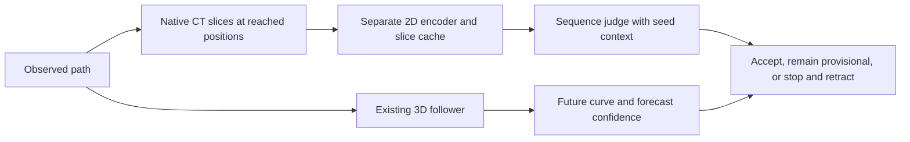

# CT slice sequence judge for the direct fiber follower

Status: implemented, 2026-09-25. Native sampling, the independent judge, joint
training/checkpoints, path archives, rollback, monitoring, and locked paired
calibration are available. See [README.md](README.md#native-ct-sequence-judge)
for commands and validation. Enforcement remains opt-in until a trained checkpoint
passes calibration; the implementation smoke is not an accuracy claim.

This replaces the proposed architecture in [RETROSPECTIVE_JUDGE_PLAN.md](RETROSPECTIVE_JUDGE_PLAN.md).
Retain that document as background for the label, replay, and rollback problems.
Implement the complete supervised judge and its inference integration as one
development effort. Do not require separate feasibility studies, frozen-encoder
experiments, or an ablation campaign before implementing it. Normal regression
checks, a training smoke run, and calibration are part of the implementation.
Self-training on unannotated traces is outside this version.

Training compute is not a readiness or acceptance gate for this implementation.
Keep the selected architecture; the compute measurements and faster alternatives
below are informational and do not require optimization or another experiment
before development.

## 1. Motivation and intended behavior

The user reports that humans can usually identify a fiber switch from the
fiber's CT appearance and the surrounding fibers. A sequence of 2D slices every
few tracing steps may provide enough evidence. Treat this as the design premise:
preserve and expose that appearance and neighborhood information explicitly.
It is not yet a measured claim about model accuracy.

The current forecast confidence head already has history-conditioned features
and explicit rejection labels for departed states. Its missing capabilities are
direct supervision of observed-path continuity, retained high-detail CT evidence
from earlier positions, and localization/removal of a bad committed tail.

Build a separate 2D CT encoder and a small sequence judge. Train it alongside
the direct follower, using the same underlying annotated fibers and collected
paths, but separate image inputs and parameters. At inference it inspects the
actual path already traced, remembers earlier CT views, and can stop and retract
a departure. The forecast gate continues to score proposed future geometry.



The question is: **does this path still continue the fiber selected by the seed,
and where did a confirmed departure first become evident?** It is not whether a
single crop contains a fiber, whether the proposed future looks plausible, or
whether the current appearance exactly matches the seed appearance.

Expected benefit: less wrong geometry retained after a switch. Stop-and-retract
alone does not increase correctly followed length or recover the right branch.
The first version stops after rollback; retracing and multiple proposals are
future work. Shared failure modes remain possible even with separate encoders.

## 2. Historical CT examples

These saved illustrations use the original public source. Per the user correction,
training, inference and new previews now use the follower CT store at level 0,
with one source voxel per slice pixel. The illustrations and benchmark timings
below do not describe the corrected default source or field of view.

Open the [interactive slice viewer](ct_slice_judge_examples/index.html), the
[full contact sheet](ct_slice_judge_examples/contact_sheet.png), or the
[sampling manifest](ct_slice_judge_examples/manifest.json).


The example uses training fiber `anon_20260815T014816946_000002.json`, sampled
at annotated arclengths 200, 204, ..., 232 trace voxels. The cyan rings are display
overlays marking the sampled path position. This is an annotated positive
example; it is not a synthetic switch, a real model rollout, or evidence that a
judge detects departures. Its source identity is recorded in the current direct
run's training fiber manifest. No calibration or final fibers were used.
Nine positions are shown for readability; training uses up to 33 recent regular
positions with the same sampling geometry, plus endpoint/reference entries.

Each position has a transverse u-v slice and two mutually orthogonal
longitudinal slices, u-f and v-f. The orientation follows the preceding path,
with parallel transport to avoid arbitrary roll between slices. CT neighbors
remain visible. These are true thin slices with trilinear interpolation, not
maximum-intensity projections or slab averages.

The example bundle also contains `slices.npz` with unwindowed CT / 255,
separate Gaussian center markers, support masks, positions, frames, and path
arclengths. Display contrast uses one shared 1st–99.5th percentile window for
the example sequence; **that display operation is not the training normalization**.
The slider can show the raw intensity range and hide the marker.

Source: the public native CT named
`PHercParis4/volumes/20260411134726-2.400um-0.2m-78keV-masked.zarr`, level 0,
shape zyx `(75784, 32693, 32693)`. The local `s1_2um_sparse.zarr` has the same
dimensions but only four level-0 chunks were present when inspected; it cannot
be treated as complete CT. The preview fetched 48 required public chunks
(96 MiB uncompressed) into `/tmp/ct-slice-judge-source/0`. That temporary cache
is not a training dataset dependency. The manifest records the source URL,
metadata hash, every fetched chunk hash, and all sample coordinates.

Do not infer physical micrometers from directory names: the source name says
2.400 um while the local folder says 2um. All geometry below uses explicitly
defined base-grid and trace-grid coordinates. Resolve physical units from source
metadata before reporting physical distances.

## 3. Concrete first-version defaults

These are implementation defaults to put in configuration and checkpoints,
not experimentally established optima. Section 9.2 records measured training
costs and faster encoder candidates; those measurements do not change these
defaults or establish equivalent detection accuracy.

| Setting | Initial value |
| --- | --- |
| Judge CT | Same store as follower `--ct`, level 0; local `s1_ds2.zarr` has four base-grid voxels per CT voxel |
| Coordinate conversion | One trace voxel = eight base-grid voxels; local level-0 xyz = trace xyz × 2 |
| Slice size | 257 × 257 pixels; odd size gives an exact center pixel |
| Pixel spacing | One source CT voxel, 0.5 trace voxels for the local store; upsampling is rejected |
| Field of view | 128 × 128 trace voxels between outer pixel centers |
| Views per sampled position | u-v, u-f, v-f; shared 2D encoder with view identifiers |
| Sampling interval along path | Four trace voxels, measured by actual path arclength |
| Recent sequence | Up to 33 regular samples spanning 128 trace voxels |
| Current endpoint | Always included; one extra temporary sample when off the regular grid |
| Older reference context | Up to four immutable seed/reference records, separately marked |
| Channels per view | CT / 255, Gaussian center marker, CT support mask |
| Center marker | Sigma two native pixels; separate from CT, never painted into CT input |
| 2D encoder | Three convolutional stages, widths 16/32/64, stage strides 1/2/2, GroupNorm + SiLU |
| Full-view tokens | Pool the final feature map to 8 × 8 tokens per view |
| Center-detail tokens | Sample a 5 × 5 grid from the first-stage feature map, one trace voxel apart, centered on the tracked point |
| Sequence decoder | Two attention blocks, width 128, four heads, FFN 256 |
| Outputs | Per-observed-prefix intact logits, known query arcs, eligibility/support diagnostics |
| Loss | Existing tracer objective + 0.5 × judge masked BCE |
| Training | Same training job; separate encoder/decoder parameters; no coordinate gradients |
| Provisional tail | 32 trace voxels, with the whole accepted output path retained for rollback |
| Development accept/alarm thresholds | Intact ≥ 0.9 / intact ≤ 0.5, provisional until calibrated |

The current direct fine input samples CT at 0.5 trace voxels from a source with
four base voxels per CT voxel. The judge now uses the same source resolution
as that fine input, with a larger field of view and its own observed-path encoder.
Pixel pitch is derived from the selected source scale; it is never made finer
than the source voxels.

## 4. Shared slice sampler and CT access

Add `direct/judge_slices.py` as the single training, collection, preview, and
inference implementation. Move the reusable sampling code from
`scripts/preview_ct_judge.py` into it; retain the script as a presentation/export
wrapper. Reuse the current `ChunkedArray`, `tight_block`, `sample_crop`,
`interp_at`, and `frame_from_heading` helpers. Do not create a second subtly
different interpolation or fiber-coordinate implementation.

The input is an observed path prefix in world trace-grid xyz plus its supplied
seed frame, path-validity mask, and persistent sampling state. The output is
`[positions, views, channels, height, width]`, world centers/frames, global path
arclengths, view identifiers, and separate support/history/reference masks.
Fiber IDs and annotation geometry are label-generation inputs only.

Sampling rules:

1. Maintain a regular arclength grid starting at the trace seed. Insert every
   newly crossed sample position after a commit, including positions inside
   stored segments. Partial commits do not move the grid phase.
2. Derive each heading from the preceding four trace voxels of observed path,
   or all available preceding length. Use the supplied seed heading when no
   preceding path exists. Transport u from the previous frame. Never use GT
   tangents for an observed/replay path or future untraced points to orient it.
3. For reproducibility, advance the frame on a fixed one-trace-voxel arclength
   grid and the regular sample positions. An off-grid current-endpoint view is
   temporary; computing it must not modify the persistent frame transport.
4. Store views/frames when acquired. Do not recenter or rerotate historical
   slices into the newest frame on every call. Record relative rotation and
   displacement for the sequence model.
5. Obtain each plane's small axis-aligned read bounds, transform trace xyz to
   source xyz using explicit scale/origin metadata, then sample trilinearly in
   source zyx. The local level-0 store uses zero origin and scale two (trace to CT coordinates). Reject
   unsupported transforms rather than silently assuming alignment.
6. Include only sampled positions already reached by the path. Static CT in a
   longitudinal slice may extend ahead of its center: that CT is available at
   the current call, so this is allowed. Future path geometry/labels are not.

Give the judge its own CT-source configuration (`judge_ct`, level, scale,
origin, source identity) rather than reusing the tracer's `vol.input_scale`.
Do not require presence or direction predictions for judge images.

Extend shared volume access to expose interpolation support: missing source
chunks, out-of-bounds samples, and failed reads must be distinguishable from
valid zero-intensity CT. A native chunk cache miss may be fetched if the
configured source supports that, but an unavailable observation remains unknown.
Use a bounded worker-local decoded LRU and an optional persistent native chunk
cache. Downloads must publish complete chunks atomically, use bounded retries,
and record source metadata; never populate a different volume's cache by shape
alone. Do not prefetch a whole native CT volume for this feature.

Read only chunks intersecting interpolation support for the requested planes,
not every chunk of their enclosing 3D boxes. A support-aware thin-plane path
should gather required chunks into bounded local buffers and reuse the existing
sampler. Keep the simple preview implementation as a correctness reference.
Profile native chunk I/O as well as neural-network cost: a 2D encoder does not
make oblique reads from 3D chunk storage automatically cheap.

## 5. Appearance memory and model

Add `direct/judge_model.py` with a distinct architecture/version. The follower
and judge have independent encoders and heads. Joint training means they share
a training loop and data provenance, not that judge gradients modify the
tracer's encoder or coordinate outputs. Observed geometry is detached and CT
resampling is outside the coordinate gradient route.

Encode the three views with the same small 2D CNN, attaching view identity.
Each stage has two 3 × 3, padding-one convolutions with GroupNorm and SiLU;
the first convolution uses stage stride 1, 2, or 2 respectively, and the second
uses stride one. Retain the first-stage feature map at native pixel spacing
for center detail; the final map has cumulative stride four. Finer output
tokens must not be produced merely by upsampling an already coarsened map.

Use two token groups per view:

- Pool the final feature map to an 8 × 8 spatial grid for the full neighborhood.
  Each pooling region spans approximately 16 trace voxels per axis, compared
  with 32 for a 4 × 4 grid at the corrected local-source spacing. These are pooling extents, not hard limits on the
  detail represented in feature channels. Pool feature coordinates with the
  same cells so positional metadata matches the actual pooling geometry.
- Bilinearly sample the first-stage feature map at a 5 × 5 grid with in-plane
  offsets `{-2, -1, 0, 1, 2}` trace voxels on each axis. This includes the exact
  tracked center and retains local evidence before downsampling or broad
  pooling. Use the actual convolution lattice for coordinate conversion.

Project each group separately to decoder width 128 and attach a token-group
identifier. There are 89 image tokens per view. Each token receives its physical
2D position, sample age/arclength, relative center/frame, view ID, and
reference/support flags. Keep both group definitions and encoder strides in
configuration and checkpoints. These defaults are architectural choices, not
measured accuracy improvements.
Positions are relative to the current trace/reference; do not provide absolute
world location or fiber identity as a shortcut for memorizing annotations.

One query per sampled position cross-attends to all eligible image tokens and
reference tokens, with self-attention among queries only; do not add self-attention
over the image-token sequence. For a fixed query count, cross-attention work
scales linearly with image-token count. At a given inference call,
later observed slices may help judge earlier positions. This is causal in tracing
time: all tokens come from the current observed prefix, and diagnostics must
not use slices acquired by a later call.

Predict an intact-prefix logit per position. Train raw logits; form monotone
decision scores from oldest to newest only across eligible chronological
queries. Padding must not lower scores. Unknown intervals must not be bridged
by taking the minimum of the remaining known points. A low score localizes a
departure to an interval between sampled positions, not an exact subvoxel point.

Keep the first up to four regularly sampled seed-context records once they
exist. Do not manufacture them from future annotation at initialization. These
are immutable context anchored to the requested seed; only the supplied seed
itself is an external identity anchor. Early predicted context is not GT and
does not become independently verified merely because it was cached.

The recent sequence carries local appearance evolution. The seed context
identifies where the trace began but need not have identical texture far away.
Persist known alarms, unresolved intervals, and the policy-accepted boundary
outside the neural window. If a missed transition has aged out and the remaining
evidence cannot distinguish identity, memory does not magically restore it.
Outputs called "verified" mean accepted under this calibrated policy, not a
mathematical or human-certified identity guarantee.

### 5.1 Continuity after seed views leave the recent window

Immutable seed records are identity context, not the moving overlap used to
extend an accepted path. Keep a compact ledger of accepted arclength intervals,
their supporting call IDs, and unresolved intervals. The initial accepted
boundary is the supplied seed at arc zero. Supplied history is observation
context; it is not automatically an externally verified prefix.

At each call, choose the oldest regular sample in the recent window that lies
in the previously accepted contiguous prefix as the overlap anchor. At startup
this is the seed. Require its cached views, a continuous accepted ledger from
the seed to that anchor, and complete supported observations from the anchor
through the candidate extension. The anchor must itself be reevaluated; prior
acceptance is not immunity from an alarm. No additional moving-reference image
slot is needed: the anchor is already a recent sample.

Form monotone decision scores over the contiguous recent queries starting at
this anchor. Older seed-only reference records are context, not extra decision
queries across the intervening gap. Persist prior alarms and unresolved intervals
in the ledger; restarting the current score sequence never clears those states.

For example, at endpoint arc 160 the regular recent window is 32..160. If the
previous accepted boundary is 144, sample 32 supplies the overlap with the
accepted ledger; immutable seed views at 0, 4, 8, and 12 remain context. Missing
views at an unresolved interval cannot be bypassed by choosing an anchor after
that interval. The ledger records previous policy decisions, not GT identity.

Keep every sampled position from the overlap anchor through an unresolved tail
until it is resolved or tracing stops. Check overlap and the provisional limit
before eviction; if the configured window cannot retain the required evidence,
stop with `judge_unverified` and export the last accepted prefix. Do not reset
the sampling origin, manufacture an accepted anchor, or cross a gap because old
seed views still exist. Unsupported immutable reference records are masked;
the seed record itself must have complete support for identity eligibility.

The ledger and these support/overlap rules define `identity_context` using only
information available at the call. Training must not substitute GT labels for
policy acceptance: replay preserves the actual decision ledger, including wrong
acceptances. Fresh constructed prefixes can be judged directly from their seed
while that seed remains in the window; examples requiring a later handoff need
a causally replayed policy ledger or are masked for identity eligibility.

During fixed-weight inference, cache both per-view spatial token groups and
encode only new sample positions. Rerun the small sequence decoder over the current window.
Drop temporary off-grid endpoint entries when replaced. Tie all feature-cache
entries to model/EMA weights, source, preprocessing, center, and frame hashes.
Training reads raw CT and re-encodes under current weights; never reuse detached
CNN features from prior optimizer updates as if they were current training data.

## 6. Training sequences and targets

Train jointly in `direct/train.py`, initializing tracer weights from an existing
direct checkpoint and initializing judge parameters independently. Provide a
new-run `--init-tracer` route rather than pretending an old checkpoint is a full
resume of a joint run. Tracer and judge parameter groups use the existing
learning-rate schedule initially. A fully joint checkpoint stores both models,
both EMA states, optimizer/RNG state, data/label versions, and all sampling options.

Use a paired sample: the follower receives its current observation/targets and
the judge receives the path sequence ending at that same state. Keep the
existing fresh/fixed/recent tracer allocations. Add a configurable judge-only
synthetic-switch allocation, initially one sequence per four paired states;
normalize the judge over all effective judge sequences, separately from the
tracer's effective batch. These extra examples do not silently alter the
tracer's geometry sampling distribution. Log realized positives, departures,
unknowns, and source fractions, including fallback when a contact cannot be built.

Judge examples include:

- Annotated continuations, augmented observed paths, and recoverable drift.
- Real collected rollouts before, through, and after departures, including
  forecast-accepted wrong paths. Keep enough context before each event.
- Synthetic A-to-B switches near contacts, with real CT sampled along the
  constructed observed path. Include smooth/tangent switches and variable ages.
- Matched valid near-contact paths, similar curvature/displacement/spacing,
  same-fiber low-contrast regions, and changing neighborhoods.
- Tagged physical endpoint overruns, censored annotation ends, unavailable CT,
  and transitions outside the usable observation window.

Generate labels independently from model decisions. Synthetic path construction
changes geometry first, then samples actual CT; do not fake a switch by pasting
images or changing contrast halfway through the sequence. Do not assume every
nearby annotation is a distinct fiber: exclude overlaps/duplicates/uncertain
contacts from confirmed A-to-B examples. Retain provenance and reject ambiguous
construction rather than invent labels.

Use a versioned common departure contract in a shared `events.py` helper:
progress-constrained original-fiber correspondence, 3.5-trace-voxel distance
threshold, at least three trace voxels of sustained violation measured on a
0.5-trace-voxel uniform path grid. Backdate a confirmed event to the beginning
of that run. These are initial label defaults, separate from forecast tolerance
1.5 and legacy evaluation's threshold/patience; retain legacy metrics alongside
the new contract. Geometric distance is an operational proxy for identity, not
proof of an anatomical switch. Retain event type for separate reporting.

Per-point labels are intact before a confirmed departure and departed afterward,
including return to the original annotation. Brief drift that does not satisfy
the sustained rule and subsequently returns within threshold remains positive.
An unfinished violating run is unknown until resolved. For constructed switches,
store both the construction interval and the first distinguishable confirmed
interval; mask ambiguous contact samples. Keep the localization target as an interval.

### 6.1 Deterministic correspondence and event confirmation

Implement the following algorithm once in `events.py`, used by collection,
archive relabeling, judge targets, and the new evaluation metrics:

1. Parameterize the original annotated polyline in tracing direction, with
   traversal coordinate `q` increasing from 0 to its length `L`. Initialize the
   progress high-water mark `h` to the supplied seed correspondence `q0` and
   the last supported observed arc `s_good` to zero. Resample the observed
   polyline at global arcs `s = 0, 0.5, 1.0, ...`, independent of commit size.
   An off-grid endpoint does not advance this persistent event state.
2. At each grid point, find the closest continuous point on annotation segments
   clipped to `q in [max(0, h-8), min(L, h+(s-s_good)+32)]`. Break equal-distance
   ties by the smallest `q`. This uses segment projection, not nearest annotated
   vertices; store the chosen `q` and distance. These bounds, tie rule, and grid
   phase are versioned label parameters, not functions of model confidence.
3. Distance at most 3.5 is supported: update `h = max(h, q)` and `s_good = s`.
   A larger distance starts or extends a violating run and freezes both progress
   variables. A supported point ends an unconfirmed run and makes its intervening
   labels positive. Once confirmed, departure remains latched even after return.
4. Confirm when `s - run_start >= 3.0`, with every intervening grid point violating.
   Thus seven samples at 0.5 spacing, not six, establish three voxels of violation.
   Store `onset_arc = run_start`, `confirmation_arc = s`, and the onset bracket
   between the preceding supported grid point and `run_start`. Negative prefix
   labels begin at onset; mask queries strictly inside the localization bracket.
   A violation already present at the supplied seed invalidates the positive
   anchor and makes the example unknown rather than inventing a prior departure.
5. Check annotation-end crossings on each observed segment before extending a
   violation. Use the oriented terminal tangent plane, an intersection within
   3.5 voxels of the endpoint, and `L-h <= (s_cross-s_good)+8` for progress support.
   The tangent is the last nonzero annotation segment in traversal direction.
   An untagged end censors labels from the crossing; a tagged physical end starts
   a confirmed `endpoint_overrun` there without the drift-duration requirement.
   An already confirmed earlier departure stays latched. A pending violation
   before censoring remains unknown; censoring does not make it positive.
6. At trace termination, keep an unresolved violating run unknown from its onset
   bracket through the endpoint. Never confirm it by padding repeated points or
   treating termination as a return. Invalid path gaps or unavailable annotation
   correspondence also censor identity labels; missing CT only changes evidence
   masks and does not change geometrically available event labels.

Process endpoint crossings and grid observations in arclength order. A crossing
at the same arc takes precedence unless departure was already confirmed earlier.
Carry partially consumed segments and pending runs between calls. Offline and
streaming processing of the same complete polyline must produce identical events.

Archive both onset and confirmation, the event bracket/type, pending/censored
intervals, and the label-contract version. Completed archives may retrospectively
resolve earlier pending targets; this is label supervision only. A training row
still receives only images, geometry, masks, and policy state available at that
row's observation cutoff. Detection latency is measured from onset, with
confirmation-relative latency also reported. Never overwrite legacy replay's
tracer `offtrack` semantics implicitly when adding the new judge event labels.

### 6.2 Evidence masks and replay

Untagged annotation ends are unknown, not negatives. Missing CT is unknown
evidence, not a departure. Valid same-fiber image gaps must not teach switches.
Known departure suffixes can retain negative identity labels beyond annotation
coverage, but insufficient input evidence must still prevent certification.
Maintain distinct label-known, path-valid, CT-support, and identity-context masks.
Do not assign unknown examples an arbitrary third "uncertain" class: uncertainty
is handled by these masks and the decision thresholds, while supervised logits
remain binary prefix labels.

The current replay format lacks path-arclength event boundaries. Add a versioned
path archive containing the visited polyline, regular slice positions/frames,
seed context, global travelled arclength, event/uncertainty intervals, and the
policy-acceptance ledger. Each row references its observation cutoff and ledger
revision in that archive. Buffer enough recent collector rows to backdate
sustained events consistently. A whole trace is stored once, not copied into
every replay row; CT pixels need not be duplicated in replay files.

Old replay still contributes existing tracer supervision. It contributes judge
targets only after explicit relabeling with sufficient original-fiber/path
context; a scalar `offtrack` flag alone does not locate a switch or justify
labeling the entire supplied history negative. Never subtract observed-history
and GT-history arrays indexwise: they use different arclength coordinates.

For fresh data, construct longer observed prefixes before extracting both model
inputs, so the two branches see the same geometry and causal frames. Keep GT
geometry exclusively in target construction. Apply geometric augmentations to
the whole path/frame construction; use modest sequence-consistent photometric
augmentation so it cannot reveal the event boundary. Represent both tracing
directions and both short startup histories and full windows.

Exclude held-out fibers and spatial regions for every slice footprint, all seed
references, both switch fibers, and tracer crops/targets. Include interpolation
support in the footprint check. A historical slice outside the current crop is
still a training input and must be checked.

The judge loss is masked BCE on raw logits, averaged over eligible known
queries within a sequence and then over the effective judge batch. Fully unknown
sequences contribute zero. Keep its weight separate from forecast confidence.
Accumulate sums/counts correctly across microbatches; log losses separately.
Judge-only switch examples may initially skip the follower forward entirely.

## 7. Inference and rollback state machine

Add a direct-specific observation/policy hook to shared tracing rather than
forking the full tracing loop. Forecast-only checkpoints and judge-disabled
runs retain their existing outputs and stopping behavior.

Each trace keeps: seed context, regular sampling state, recent raw/token cache,
global path arclength, last policy-accepted boundary, provisional tail, unknown
intervals, latched alarm, and audit records. Keep accepted geometry available
for truncation if a later call revises an earlier interval.

On each call:

1. Sample/encode the actual new path points since the previous call, including
   the current endpoint. The judge sees committed observations, never this
   call's uncommitted forecast coordinates.
2. Evaluate prefix logits and eligibility. Initial eligibility requires at least
   four chronological samples spanning 12 trace voxels, available seed/reference
   context, and the overlap/ledger contract in section 5.1. Require complete
   interpolation support in all selected views at every sampled position from
   that overlap anchor through the interval being accepted. Shorter starts remain
   provisional and are represented during training. Expose support details and
   the anchor arc; annotation labels never participate in inference eligibility.
3. If an eligible intact score is at or below the alarm threshold, latch the
   alarm and stop. Truncate to the last accepted sample before the first failing
   interval, even if that revises an earlier accepted boundary. Discard the
   entire uncertain interval; do not claim finer localization than slice spacing.
4. Advance the accepted boundary only across a contiguous eligible prefix whose
   intact scores meet the acceptance threshold. Normally retain the newest
   eight trace voxels provisionally to let one subsequent commit provide more
   appearance evidence. Acceptance and alarm thresholds leave a deliberate
   uncertain range; neither middle scores nor missing support count as acceptance.
   During continued tracing advance only to regular sample arcs; an off-grid
   endpoint may be accepted by the final audit. Record each accepted interval in
   the ledger, and invalidate later ledger entries if an earlier alarm retracts it.
5. If uncertainty leaves more than 32 trace voxels beyond the accepted boundary,
   stop with `judge_unverified` and export the accepted prefix. Do not blindly
   advance the reference or evict unresolved evidence to make room. An alarm
   outside retained image context falls back to the last accepted boundary
   preceding the uncertain interval, with the limitation recorded.
6. If allowed to continue, run the existing forecast commit policy. After any
   commit, update geometric state and sampled-path records normally.

At every exit, including forecast confidence, bounds, loop, maximum length, and
partial final commits, audit the last tail before final export. A final judge
call may accept an eligible tail without the ordinary eight-voxel delay, using
only currently available CT; low confidence/support leaves it provisional.
If startup context never became sufficient, return the seed/known input prefix
with an unverified-tail reason rather than claiming that new geometry was checked.
Optional diagnostic exports may include provisional geometry but must label it
separately from the accepted output.

Map all boundaries by actual trace arclength, with interpolation within a stored
segment. Recompute output length, geometry, stop reason, discarded-good/wrong
length, and audit metadata consistently. Alarm state cannot reset merely because
the switch leaves the recent window. Collection has an explicit bounded
exploration mode that can continue after an alarm to gather negative examples;
those extra points are never exported as judge-approved inference output.

## 8. Integration map and implementation order

The following are engineering increments within this implementation, not
separate research approval gates.

| Increment | Files / work | Completion check |
| --- | --- | --- |
| Slice observation | `direct/judge_slices.py`, shared `volume.py` support-aware CT access; refactor preview | Reproduce the example, source masks, native scale, and consistent frames |
| Path data and labels | shared `events.py`, `data.py`, `collect.py`, `direct/data.py`, `direct/collect.py` | Versioned path/event archive; causal sampling; old replay remains usable |
| Judge and joint loss | `direct/judge_model.py`, `direct/judge_supervision.py`, `direct/train.py` | Both branches train in one job; no cross-model gradients; EMA/resume works |
| Rollback policy | `trace.py` extension hooks, `direct/data.py`, `direct/infer.py`, trace config | Judge enabled stops/retracts; disabled reproduces old policy; final-tail audit |
| Integrated reporting | `direct/diagnostics.py`, recovery/rollout evaluation scripts, README/launcher | CT sequence panels, calibrated thresholds, paired rollout report |

Add CLI options for judge enablement, native CT source/cache/transform, sampling
size/spacing/window, reference count, loss weight, synthetic allocation, and
accept/alarm thresholds/provisional limit. Architecture/data parameters belong
in checkpoints; policy thresholds belong in saved calibrated inference settings.
Reject incompatible resume options explicitly. Legacy inference needs no judge
CT connection when the judge is disabled.

Diagnostics should show the exact input slice sequence with path markers,
predicted scores, GT event interval where known, eligibility, accepted boundary,
and retained/discarded path. Include real departures and valid near contacts in
routine monitor diagnostics. Do not substitute clean annotated sequences alone
for the actual observed-path input.

## 9. Verification and integrated acceptance

Add focused regression tests as code lands:

- Base/trace/source coordinate conversion, xyz/zyx, plane orientation, native
  interpolation, missing chunks vs valid zeros, frame continuity and prefix
  invariance, and no GT/future geometry in observed sampling.
- Sampling every crossed arclength interval, partial commits, short startup,
  temporary endpoint entries, seed/reference masks, and feature-cache invalidation.
- Encoder strides, pooled token coordinates, center-grid lattice alignment and
  exact center inclusion, both token-group shapes/identifiers, and cache reuse.
- Label chronology, sustained-event backdating, recoverable drift, ambiguous
  contacts, unknown endpoints, true endpoints, return after departure, source
  fractions, archive alignment, and all image-footprint split exclusions.
  Include runs ending before confirmation, six versus seven violating grid
  samples, continuous segment correspondence/ties, and identical events under
  different commit partitions and offline versus streaming processing.
- Masked BCE, all-unknown states, newest/oldest ordering, padding/unknown-safe
  decisions, microbatch equivalence, independent gradient routes, EMA and resume.
- Conservative rollback between queries, revision of earlier accepted geometry,
  persistent alarms, uncertainty-window overflow, final-tail audit, and exact
  judge-disabled behavior. Include traces longer than the recent window, seed
  views with no recent overlap, accepted-ledger handoffs, missing overlap records,
  unresolved gaps, and a previously accepted anchor later receiving an alarm.
- Calibration metric partitions, uncertainty stops and final-tail truncation,
  identical forecast thresholds in each pair, zero-denominator handling,
  deterministic selection/ties, and locked final-policy loading.

Run the existing direct/shared tracing tests and a small real-CT joint
training/EMA/checkpoint-resume smoke. These are implementation correctness checks,
not separate model-selection experiments required before development.

During the same training run, report monitor false alarms, departure recall by
one/two calls, event latency in trace arclength, boundary interval error, good
length discarded, wrong length retained, coverage, and recovery. Count misses
explicitly, stratify real vs synthetic and by CT support, and group uncertainty
estimates by fiber/trace rather than individual nearby slices.

### 9.1 Calibration and policy selection

Select accept/alarm thresholds together on the existing calibration split.
For each joint checkpoint, sweep the existing forecast thresholds
`{0.5, 0.7, 0.8, 0.85, 0.9, 0.95, 0.98}`, judge acceptance thresholds
`{0.7, 0.8, 0.85, 0.9, 0.95, 0.98}`, and alarm thresholds
`{0.1, 0.25, 0.4, 0.5, 0.6}`. Require `alarm < accept`. Keep the eight-voxel
acceptance delay and 32-voxel provisional limit fixed. Freeze this search and
the checkpoint candidate list before reading calibration results; save them
with a protocol hash. Search overrides require a separately recorded protocol.

Each judge-enabled rollout is paired with a forecast-only rollout using the
same checkpoint, forecast threshold, seeds/directions, sampling RNG, commit
settings, and maximum length. Reuse that baseline across judge threshold pairs.
Judge enforcement only stops/retracts; it must preserve forecast geometry up to
its stopping call. Assert this prefix agreement in evaluation. A different
forecast threshold is a separate pair, never a substitute baseline.

Use the new section 6.1 contract for these acceptance metrics and retain legacy
metrics separately. Label the complete forecast-only path once, including
pending/censored intervals, and intersect that partition with each retained
judge prefix. Do not relabel a shortened output as intact merely because its
confirmation suffix was removed. Partition lengths conservatively: the onset
bracket is unknown, wrong length starts at the confirmed onset (or tagged
endpoint crossing), and earlier supported length is correct. Known wrong
suffixes remain wrong after return. Report unknown length separately.

Define, pooled over the paired traces:

- `C0`, `Cj`: correctly retained observed-path arclength for forecast-only and
  judge outputs. This is not annotation progress (`followed`) or coverage.
- `W0`, `Wj`: wrong retained arclength under the same event partition.
- `F`: additional false-stop count, at most one per directed trace. Count a
  judge-induced termination whose observed decision endpoint is in a known
  intact interval and whose exported boundary discards positive correct length
  available in the paired baseline. Include `judge_unverified` and final-audit
  trimming of a known intact tail, even when the primary stop reason is forecast
  confidence or a length cap. An alarm after a confirmed departure is not a
  false stop; any good geometry it retracts still reduces `Cj`. Unknown event
  intervals produce an unknown-stop count, never an assumed true/false stop.

Initial acceptance budgets are `1-Wj/W0 >= 0.50`, `(C0-Cj)/C0 <= 0.02`, and
`10000*F/C0 <= 1`. Also require retained scored precision
`Cj/(Cj+Wj) >= 0.95`. Zero `W0` cannot establish a wrong-length reduction;
zero correct exposure or scored length also makes a pair ineligible. Report
coverage and annotated progress separately. Missing-source and unknown-stop
counts must accompany the budgets rather than disappearing from reports.

Among candidates meeting these budgets, select maximum `Cj`, then minimum `Wj`,
then minimum `F`. Remaining ties use lexicographic order of checkpoint SHA-256,
forecast threshold, acceptance threshold, and alarm threshold. If no candidate
qualifies, write a failed-calibration report and retain forecast-only defaults;
explicit development/opt-in judge settings remain usable.

Use 2,000 paired fiber-bootstrap replicates with seed zero, keeping all seeds
and directions for a fiber together, to report 95% intervals for the metrics.
Undefined replicate denominators are reported, not replaced with zero. Zero
observed false stops must not be presented as a proven zero rate: report valid
exposure and the approximate Poisson zero-event upper 95% rate
`-log(0.05)*10000/C0` as an additional, explicitly model-dependent diagnostic.
Budget satisfaction in point estimates selects a candidate; it does not by
itself establish adequate evidence for default enforcement. If intervals cross
the budgets, denominators are unsupported, or rare-event exposure cannot
support the claim, mark enforcement opt-in. Do not promote on synthetic examples
alone or change budgets after seeing results; the implementation is still delivered.

Lock the selected thresholds, checkpoint/source hashes, event/metric versions,
protocol hash, and tail settings in `selection.json`. Record whether the policy
is opt-in or eligible for default enforcement. Final evaluation consumes this
selection without retuning, and compares against its exact paired forecast-only
settings on the untouched final split.

Also compare the initialized tracer checkpoint to the joint-trained tracer with
judge enforcement off, to expose ordinary training changes. An exhaustive
architecture/data ablation study is not a prerequisite requested by the user.
Keep the existing untouched final split for the locked policy comparison.

Measure end-to-end latency and memory on fixed inputs with warm and cold CT
caches, plus slice reads, newly encoded views per call, and decoder time. A
33-position, three-view window has 6,538,851 CT pixels (~25 MiB in float32 before
markers/support), while a typical eight-voxel commit adds only two regular
positions. The 64 full-view plus 25 center-detail tokens per view give 8,811
image tokens for 33 positions. Budget up to 10,146 for 38 entries including four
older references and one temporary endpoint; avoid duplicating references that
are already in the recent window. At width 128, those 10,146 projected tokens
alone occupy about 4.95 MiB in float32, excluding attention projections, decoder
activations, and raw slices. Cache image features independently of call-relative
position/age metadata, which must be refreshed for the current window.
Encode views in bounded minibatches; the CNN activations, native chunk reads,
and token cache all require explicit budgets. Profile pooling, center sampling,
and query-to-image attention separately. Report actual costs rather than
assuming 2D means negligible overhead.

### 9.2 Measured training compute and encoder alternatives

On 2026-09-25, a standalone prototype was benchmarked on an RTX 5090 with
BF16 autocast, FP32 weights, channels-last convolutions, and `torch.compile`.
The encoder comparison used three warmups and 30 measured updates per variant,
with CUDA synchronization around each update. Each combined update contains
eight follower states and ten judge sequences, including the planned 25% extra
judge allocation; microbatch size is two and view-encoding minibatch size is 33.
Timings include forward, loss, backward, gradient clipping, AdamW, and EMA.
Compilation time is excluded.

| Encoder / center sampling | Mean update ms | Median ms | p95 ms | Peak allocated GiB | Speedup |
| --- | ---: | ---: | ---: | ---: | ---: |
| Current plan / bilinear | 282.4 | 280.8 | 301.1 | 6.31 | 1.00× |
| Current plan / direct indexing | 284.1 | 281.8 | 297.7 | 5.53 | 0.99× |
| Native first stage, pooled wider context / indexing | 189.3 | 188.5 | 198.1 | 4.29 | 1.49× |
| Native center crop + half-resolution context / indexing | 117.0 | 116.6 | 120.3 | 1.80 | 2.41× |

All variants retain 33 positions, three views per position (99 images), 64
full-view plus 25 center tokens per view, and the same decoder and channel widths.
The earlier ten-update baseline measured 31.6 ms for eight complete follower
states alone, including its correction and forecast-confidence heads, and
206.3 ms for eight full judge sequences (about 25.8 ms per sequence). These
are training-update measurements, not cached inference timings.

The candidates make different information/compute tradeoffs:

- **Direct indexing:** At the configured integral center locations, select the
  25 feature pixels before converting to float32. CPU FP32/BF16 checks found
  exactly equal values and gradients to bilinear sampling. This saves memory
  without a clear speed gain; nonintegral locations still require interpolation.
- **`feature_pool2`:** Preserve the native first stage and its center features,
  then apply 3 × 3 average pooling with stride two and padding one before the
  remaining context stages. This is the more conservative representation change:
  native center features at fixed weights are retained, while deeper
  neighborhood features change. Measured combined update time falls by 33%.
- **`dual_scale`:** Encode a native 65 × 65 center crop (eight trace voxels
  across) and a 129 × 129 full-view context image, using shared first-stage
  weights. Form context with 3 × 3 average pooling, stride two, padding one;
  only context traverses the deeper stages. The center retains native pixels
  and the same token offsets. Context retains the 32-voxel field of view at
  0.25 trace voxels per sample, twice as fine as the follower's fine input.
  Crop-local normalization changes center features despite retaining native
  pixels. Measured combined update time falls by 59%.

The two-scale encoder is the preferred faster candidate to consider; the
feature-pooling alternative preserves more native neighborhood processing.
Neither has been trained or evaluated on real departures. Fine neighboring
texture may matter for distinguishing fibers, so retaining token count and
center resolution does not establish equal switch-detection performance.

These are GPU-resident compute measurements using repeated preview CT to fill
the judge window, synthetic follower inputs/targets, and placeholder judge
metadata/labels. They exclude CT reads, sampling, host-to-device transfer,
collection, diagnostics, and extra reference/endpoint entries. Neither variant
demonstrates a native I/O improvement or end-to-end training speedup. An eager
profile implicated convolutions, normalization, and tensor copies more than
attention; compiled measurements above determine the reported speedups.

See [the benchmark report](CT_SLICE_JUDGE_BENCHMARK.md) for full methodology,
raw-result locations, and exact reproduction commands, and
[`scripts/benchmark_ct_judge.py`](../scripts/benchmark_ct_judge.py) for the
disposable prototype. The current architecture remains the baseline in sections
3 and 5; the faster variants are recorded as measured options.

## 10. Preview the local CT

From `fiber_follow/`, using the existing environment:

```bash
PYTHONDONTWRITEBYTECODE=1 NUMBA_CACHE_DIR=/tmp/ct-judge-numba \
MPLCONFIGDIR=/tmp/ct-judge-mpl PYTHONPATH=../../.. \
/home/sean/Documents/villa/vesuvius/.venv/bin/python \
  scripts/preview_ct_judge.py --out /tmp/ct-judge-local-preview
```

The preview defaults to the same local level-0 CT at one source voxel per pixel.
It performs no downloads and fails on missing interpolation support. To reproduce
the historical saved examples from their existing cache, explicitly pass
`--ct-array /tmp/ct-slice-judge-source/0 --ct-grid-scale 1 --spacing 0.125`.
Remote fetching requires both an explicit `--source` and `--ct-array` destination. It writes the contact sheet, raw/display PNGs,
interactive HTML viewer, numerical arrays, and source/sampling manifest under
`direct/ct_slice_judge_examples/`. It does not modify annotations, model weights,
the active training run, or the original CT stores.

The production sampler in `direct/judge_slices.py` now supplies the preview and
actual observed-path inputs, persistent stream state, per-pixel support, and split
exclusions. The preview remains a presentation wrapper, not a training dataset.

Preview verification completed on 2026-09-25: all 27 views have full source
support; 3,072 sampled pixels from six views agreed with independent SciPy
trilinear interpolation to at most `5.96e-8` in normalized intensity. All frames
were orthonormal/right-handed, all views agreed at their shared center, and
extending the sequence left earlier centers/frames unchanged. Results are in
[verification.json](ct_slice_judge_examples/verification.json). The shared
sampler regression suite passed 48 tests with:

```bash
OMP_NUM_THREADS=1 MKL_NUM_THREADS=1 PYTHONDONTWRITEBYTECODE=1 \
PYTEST_DISABLE_PLUGIN_AUTOLOAD=1 NUMBA_CACHE_DIR=/tmp/ct-judge-numba \
MPLCONFIGDIR=/tmp/ct-judge-mpl PYTHONPATH=../../.. \
/home/sean/Documents/villa/vesuvius/.venv/bin/python -m pytest \
  tests/test_fast_sample.py -q -o cache_dir=/tmp/ct-judge-pytest
```

## 11. Proposed user workflow after implementation

The following commands are implemented by the direct trainer and native-source reader.
`--init-tracer` initializes from the saved EMA tracer weights and records the
source checkpoint hash; it starts a new optimizer schedule and run. Full
`--resume` instead restores both branches and their training state.

```bash
bash scripts/launch_direct.sh direct_ct_judge_run1 \
  --init-tracer output/direct_corrected_run1/ckpt_009000.pt \
  --judge \
  --judge-ct-level 0 \
  --judge-pixels 257 \
  --judge-path-step 4 --judge-history-length 128 \
  --judge-loss-weight 0.5
```

The regular monitor run writes judge slice panels and paired rollout metrics.
Extend `scripts/evaluate_direct.py calibrate` to select and save both judge
thresholds alongside the forecast threshold, checkpoint/source hashes, and tail
policy. Final evaluation and `direct.infer` consume that saved selection;
inference should not require manually reconstructing a combination of thresholds.
Provide an explicit forecast-only override for paired comparisons. Do not start
training, alter the running tracer, or enable enforcement merely by writing this
plan and its example assets.
