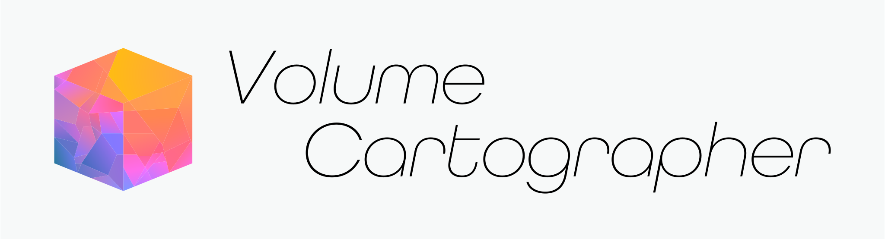
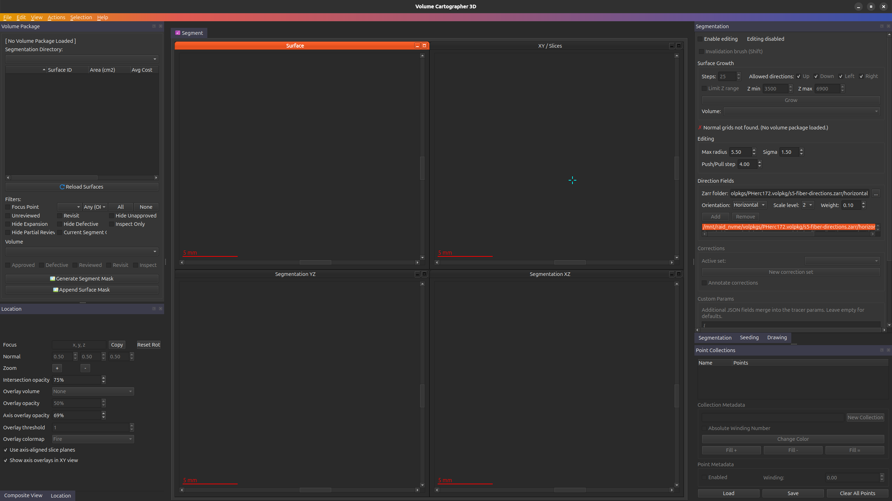
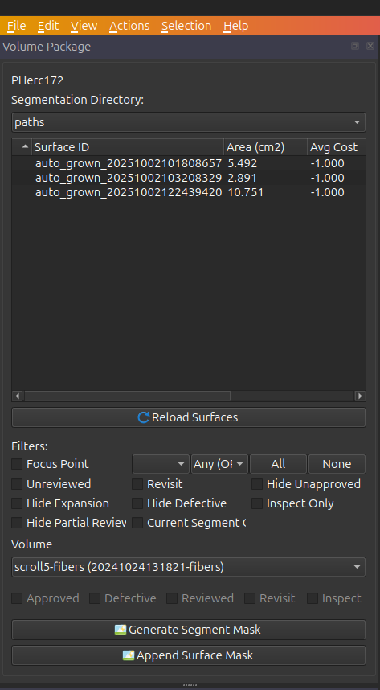
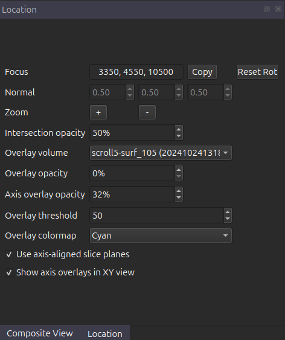
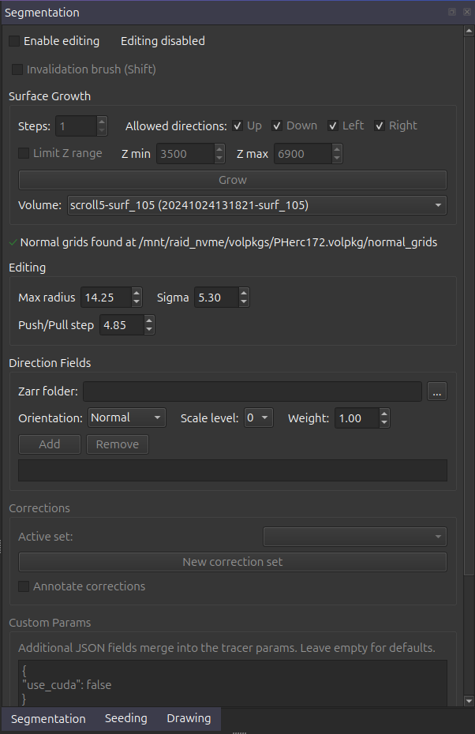
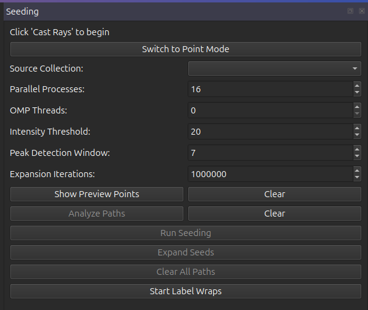

**Volume Cartographer** is a toolkit and set of cross-platform C++ libraries for
virtually unwrapping volumetric datasets. It was designed to recover text from
CT scans of ancient, badly damaged manuscripts, but can be applied in many
volumetric analysis applications.

This repository (a.k.a. **"VC3D"**) is a version of [EduceLab](https://educelab.engr.uky.edu/)'s original.
Via Vesuvius Challenge, it has gone through a few forks:
[EduceLab](https://github.com/educelab/volume-cartographer) (original) ->
[Julian Schilliger](https://github.com/schillij95/volume-cartographer-papyrus) (optical flow segmentation) ->
[Philip Allgaier](https://github.com/spacegaier/volume-cartographer) (performance/usability improvements) ->
[Hendrik Schilling and Sean Johnson](https://github.com/hendrikschilling/volume-cartographer) (various improvements) ->
this repository (developed and maintained by the Vesuvius Challenge team).
The original Volume Cartographer is a general purpose toolkit for virtual unwrapping, while this version is specialized for the frontier challenges of the Herculaneum papyri.

### Installation Instructions
Due to a complex set of dependencies, it is *highly* recommended to use the docker image. We host an up-to-date image on the [github container registry](https://github.com/ScrollPrize/villa/pkgs/container/villa%2Fvolume-cartographer) which can be pulled with a simple command :

```bash
docker pull ghcr.io/scrollprize/villa/volume-cartographer:edge
```

To install VC3D and all command-line tools from source on a recent Debian-family
Linux distribution using APT:

```bash
./build_from_src_debian.sh
```

The script installs build dependencies from system packages, builds VC3D and
flatboi, and installs the runtime under `/usr/local` so commands such as
`VC3D` and `vc_grow_seg_from_seed` are available from the terminal. The
distribution must provide CMake 3.28 or newer; Ubuntu 24.04+ and Debian 13+
meet that requirement. Set `JOBS`, `BUILD_DIR`, or `PREFIX` to override the
corresponding defaults.

#### Windows

A self-contained Windows 10/11 installer (`VC3D-<version>-win64.exe`, with all dependencies bundled) is attached to each [GitHub release](https://github.com/ScrollPrize/villa/releases) — download, run, and launch VC3D from the Start menu. A portable `.zip` of the same tree is published alongside it.

To build natively from source on Windows, use an [MSYS2](https://www.msys2.org/) UCRT64 shell (see [.github/workflows/vc3d-windows.yml](../.github/workflows/vc3d-windows.yml) for the package list), then:

```bash
cmake --preset ci-windows-mingw
cmake --build --preset ci-windows-mingw
cpack --config build/ci-windows-mingw/CPackConfig.cmake
```

Note: the flatboi SLIM flattening tool (PaStiX-based) is not available on Windows; Docker or WSL still covers that workflow.

#### macOS

A self-contained `VC3D.app` for Apple Silicon (`VC3D-<version>-macos-arm64.dmg`, with all dependencies bundled) is attached to each [GitHub release](https://github.com/ScrollPrize/villa/releases) — drag it to Applications. The app is not notarized, so the first launch is right-click → Open (or `xattr -dr com.apple.quarantine /Applications/VC3D.app`). The `vc_*` command-line tools ship inside the bundle at `VC3D.app/Contents/MacOS/`.

To build from source on macOS, use the Homebrew LLVM build helper:

```bash
scripts/build_macos.sh --install-deps
```

After dependencies are installed, rebuilds can use:

```bash
scripts/build_macos.sh
```

[installation instructions for docker](https://docs.docker.com/engine/install/)

[running docker as a non-root user](https://docs.docker.com/engine/install/linux-postinstall/)


### Basic introduction to VC3D 
The document below is a basic introduction to the ui and keybindings available in VC3D, more detailed documentation is available in the [segmentation tutorial](https://scrollprize.org/segmentation) on the scrollprize website.
> [!WARNING]
> if you are using Ubuntu, the default open file limit is 1024, and you may encounter errors when running vc3d. To fix this, run `ulimit -n 750000` in your terminal.

### Launching VC3D

If you're using docker : 

```bash
xhost +local:docker
sudo docker run -it --rm \
  -v "/path/to/data/:/path/to/data/" \
  -v /tmp/.X11-unix:/tmp/.X11-unix \
  -e DISPLAY=$DISPLAY \
  -e QT_QPA_PLATFORM=xcb \
  -e QT_X11_NO_MITSHM=1 \
ghcr.io/scrollprize/villa/volume-cartographer:edge
```

From source : 

```bash
/path/to/build/bin/VC3D
```



### Data 
VC3D requires a few changes to the data you may already have downloaded. All data must be in OME-Zarr format, of dtype uint8, and contain a meta.json file. To check if your zarr is in uint8 already, open a resolution group zarray file (located at /path/to.zarr/0/.zarray) look at the dtype field. "|u1" is uint8, and "|u2" is uint16. 

### Remote virtual-volume locators

VC3D can expose a public remote pyramid group as logical level 0 without
copying or renumbering the source Zarr. Append the portable fragment selector
`#vc-base-scale=N`, where `N` is an integer from 0 through 5:

```text
https://example.org/volume.zarr#vc-base-scale=2
s3://bucket/volume.zarr#vc-base-scale=2
```

Level 0 canonicalizes to the ordinary selector-free locator. For a base-2
view, source groups `/2`, `/3`, ... become logical levels 0, 1, ...; voxel
coordinates and voxel size are therefore those of physical `/2`. The source
must be a contiguous numeric, isotropic dyadic ZYX pyramid with zero coordinate
translations. Query parameters remain part of the network URL and must precede
the fragment, for example `volume.zarr?token=abc#vc-base-scale=2`.

Coordinate-bearing artifacts created by VC3D retain the selected source view
in their JSON metadata (`meta.json`, point collections, fibers, and atlas
`metadata.json`). For example:

```json
{
  "vc_open_data_coordinate_space": "PHerc1451/20260319101107@L2",
  "vc_open_data_source_path": "s3://path/to/the/source/volume",
  "vc_open_data_source_coordinate_level": 2,
  "vc_open_data_source_coordinate_scale_factor": 4,
  "vc_open_data_source_original_resolution": 2.4
}
```

The source path identifies the native volume without the `#vc-base-scale`
selector. The scale factor is `2^level`, and the original resolution is the
native level-0 voxel size in micrometers.

The selector is part of persistent volume identity but is never sent in HTTP
requests. Tools that support remote volumes receive the complete portable
locator. Local-only tools reject it instead of silently discarding the
selector. Catalog surfaces, normal grids, and overlays are automatically paired
only when their explicit coordinate-space tags match the selected view.

The meta.json contains the following information. The only real change from a standard VC meta.json is the inclusion of the `format:"zarr"` key.
```json
{"height":3550,"max":65535.0,"min":0.0,"name":"PHerc0332, 7.91 - zarr - s3_raw","slices":9778,"type":"vol","uuid":"20231117143551-zarr-s3_raw","voxelsize":7.91,"width":3400, "format":"zarr"}
```
Your folder structure should resemble this: 
```
.
└── scroll1.volpkg/
    ├── volumes/
    │   ├── s1_uint8_ome.zarr -- this is your volume data/
    │   │   └── meta.json - REQUIRED!
    │   └── 050_entire_scroll1_ome.zarr -- this is your surface prediction/
    │       └── meta.json - REQUIRED!
    ├── paths 
    └── config.json - REQUIRED!
```
### Opening a volume package and navigating the UI
First, click `File -> Open volpkg` and select the volpkg you wish to work with (select the folder ending in .volpkg)

On the left side of the UI, you have a few dock widgets. The first being the Volume Package / Surface List. The most important things to note here are the `Volume` dropdown list, which selects the currently displayed volume, and the `paths` surface list, which selects the currently displayed segment. Selecting a `Surface ID` should populate the `Surface` volume view in the top left, and initialize the rest the volume viewers.

There are a number of widgets, each with their own purpose. From top to bottom, and left to right : 

**Volume Package**

_Main UI widget for interacting with the volume package and surface list_



- `Reload Surfaces` : checks for new segmentations in the currently selected directory (by default, this is {volpkg}/paths
- `Filters` : Apply a single (or multiple) filters to show or hide specific surface ids from the current set
  - the most important one to remember here is `Current Segment Only`, which will hide the intersection overlays of all other segmentations in the volume viewers (this can greatly speed up ui interaction)
- `Approved`, `Defective`, `Reviewed`, `Inspect`  : tags which can be applied to the surface meta.json, and filtered against
- `Generate Surface Mask` and `Append Surface Mask` : Create a binary mask representing the valid surface, and optionally append the current selected volume to it as a multipage tif

**Location**

_Main UI widget for adjusting the ROI and display of the volume viewers_



- `Focus` : Displays the current location of the focus point (in XYZ) -- also can be used to set the focus point by modifying the values in the text box
- `Zoom` : Can be used in place of scroll wheel based zooming, mostly exists to alleviate touchy track pad zooming
- `Overlay Volume` : Selects the volume to overlay onto the base volume 
- `Overlay opacity` : Modifies the opacity of the overlay volume 
- `Axis overlay opacity` : Modifies the opacity of the plane slice axis overlays
- `Overlay threshold` : The value of the overlay array below which will not be rendered on the base volume (useful for removing background)
- `Overlay colormap` : The colormap to use for the overlay volume
- `Overlay interpolation` : Selects nearest-neighbor (default) or trilinear sampling independently of the base volume
- `Use axis aligned slices` : by default, vc3d attempts to align your XZ and YZ planes orthogonal to the normal of the current selected surface, this checkbox will instead use the plane normal as the axis to slice along
- `Show axis overlays in XY view` : if you do not wish to view the axis overlays in the XY view, this checkbox will disable them

_Keybinds:_
> - `Right mouse + drag` : pans the current viewer
> - `Scroll wheel` : zooms the current viewer
> - `Ctrl + left mouse button` : centers the focus point on the cursor position
> - `Scroll wheel click + drag` : rotates the slicing pane in the XZ or XY volume viewers
> - `Spacebar` : toggles the overlay on / off
> - `C` : toggle a composite view of the current surface in the segmentation window (parameters of which can be located in the "composite" dock tab, next to the location tab)

**Segmentation**

_Primary entry point for interacting with the segmentation, more info in the [segmentation docs](docs/segmentation.md)_
 


- `Enable editing` : Must be checked to enable any of the actions in this widget. Creates a copy of the base surface upon which we perform any of the following actions
- `Surface Growth` - grouping of settings mostly pertaining to the `Grow` action
  - `Steps` : The number of "generations" the growth action will undertake
  - `Allowed Directions` : Limits the directions of growth _relative to the flattened 2d quad surface!_ (i.e if you look in the segmentation window in the top left, and you set 'up' it will grow towards the top of the window)
  - `Limit Z range` : Constrains the growth to a selected `Z` range
  - `Volume` : the volume to pass to the `tracer()` call _should be a surface prediction volume!_ 
- `Editing` - grouping of settings which mostly apply to drag/push/pull actions for mesh deformation. All mesh deformation-type actions are performed on a gaussian-like area which has a circular shape centered at the current mouse location and whose strength is reduced as we reach the edges. _Radius is in quad vertices in the 2d flattened surface._
  - `Max Radius` : the maximum radius of the area to be affected by the action
  - `Sigma` : the _strength_ of the push/pull on affected vertices other the original one (aka how quickly the influence tapers as we step away from the original point)
  - `Push Pull Step` : The number of "offset steps" to take along the surface normal (in voxels) for each push/pull action (this parameter only affects the push/pull in the segmentation window that is applied with `F` and `G`)
- `Direction Fields`
  - `Zarr folder` : the path containing the direction field you want to use for optimization (ex: `/path/to/scroll.volpkg/fiber-directions.zarr/horizontal`) _these are optional_ 
    - `Orientation` : the orientation/type of the direction field (from horizontal, vertical, or normal)
    - `Scale level` : the zarr resolution from which these were computed
    - `Weight` : the weight to apply to the field when optimizing.
- `Corrections` : group which controls / manages the "correction points" for the current growth session
  - `New correction set` : creates a new point collection containing a single "correction" 
      
_Keybinds:_
> - `F` or `G` : push/pull the current surface in a positive or negative direction along the surface normal (only works in the surface
> - `1`, `2`, `3`, `4`, `5` : select a direction to grow in -- left, up, down, right, all, respectively
> - `T` : create a new correction set

**Seeding** 

_Widget for creating initial segmentations which can be used for traces or later growth actions_



- `Switch to point mode` : toggles the seeding widget into draw mode (not recommended)
- `Source Collection` : the source point collection to use as seed points (will autofill if you draw/analyze)
- `Parallel processes` : the number of processes to run seeding with
- `OMP Threads` : limits the amount of threads each process can use (recommend to set this to 1)
- `Intensity threshold` : mostly unused, can leave default
- `Peak detection window` : how closely each peak detected along a path/raycast can be
- `Expansion iterations` : how many iterations to run expansion mode on after initial seeding
- `Show Preview Points` : unused, can be ignored
- `Clear` (both) : clears current points, paths, or raycasts
- `Analyze Paths` : after drawing paths, detect peaks along the line segment on which to place seed points
- `Run seeding` : creates segmentations from the current seed points
- `Expand seeds` : expands the current seed points to the given number of iterations
- `Clear all paths` : clears any user drawn paths / points (use this over the clear buttons most of the time)
- `Start label wraps` : this is used for absolute or relative wrap labels, is not used during the seeding step, will detail in another document
