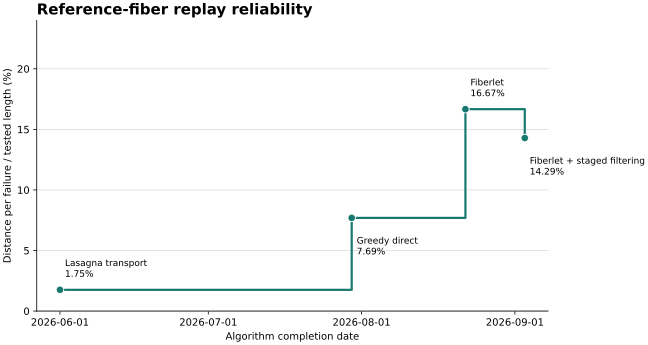
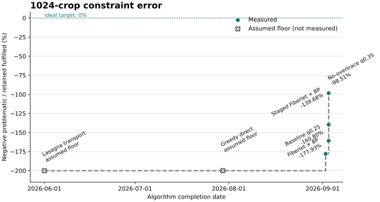
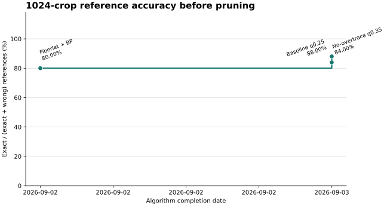

# Fiber benchmark results

This index records scientific benchmark invocations. Each row links to the
complete command, source revision, effective settings, artifact identities,
timing, and detailed results. These are manual external-data measurements, not
CI performance gates.

## Progress Plots



Reference replay uses `100 / (failures + 1)`: every failure splits the complete
tested reference corpus into one additional contiguous segment. This is the
mean segment length divided by total tested directed length. Higher is better;
only a zero-failure result reaches 100 percent.



The crop plot preserves the recorded problematic-to-retained error ratio and
negates it so higher is better:
`-100 * problematic / retained_fulfilled`. The original capped Fiberlet result
is `-177.93%`; the ordinary density-`0.25` result is `-160.80%`; the staged
uncapped result is `-139.68%`; and no-overtrace with the `0.35` quality
threshold is `-98.51%`. Ambiguity stopping at margin `0.40` and density `0.21`
is `-89.95%`. Zero is the ideal target. The direct greedy and Lasagna markers
are unmeasured plotting-floor assumptions without numeric benchmark values;
neither produces the candidate-piece graph required by this benchmark. The
three plots use different metrics and their percentages are not numerically
comparable.



The pre-pruning reference plot uses `100 * exact / all tagged reference fibers`
at oracle round zero. Wrong and missing references both remain in the
denominator. Across the 26-fiber stack, the fixed-quarter baseline is 76.92%;
no-overtrace at density `0.35` is 80.77%; and the ordinary stored cohort
filtered at density `0.25` is 84.62%. Ambiguity stopping at margin `0.40` and
density `0.21` reaches 92.31%. These are reference-tuned measurements on the
same crop, not held-out validation results.

The horizontal coordinate is an integer experiment step after a stable sort by
historical algorithm completion date; experiments recorded on the same date
retain their JSON order. Step numbers label every result, while a few spaced
steps also show representative completion dates. Each data row separately records
algorithm and measurement revisions. Regenerate all deterministic SVGs with:

```bash
python volume-cartographer/scripts/plot_fiber_benchmarks.py
```

Add later results to `docs/fiber_benchmark_plot_data.json`; scores are derived
from raw failure or unique-constraint counts rather than copied percentages.
Markers show every measured result at its actual score. Strict measured
best-so-far points form the Pareto frontier, receive the only text annotations,
and advance the step line. Every later non-frontier result has its own marker
and named entry in the legend below the graph, without lowering the historical
progress line. Assumed-floor controls are named individually there as well and
never initialize or advance the measured frontier.

Each algorithm variant has a stable `method_id` and base `method_label` shared
across metrics. A benchmark-stage suffix is appended without rewriting that
base label: for example, `Fiberlet + staged filtering` becomes
`Fiberlet + staged filtering + BP` in BP-derived plots. Assumed-floor controls
do not receive a stage suffix for work they did not execute.

## Reference endpoint replay

| Date | Revision | Policy | Crop | Tested length | Failures | Mean segment | Segment % | Wall time | Run |
| --- | --- | --- | --- | ---: | ---: | ---: | ---: | ---: | --- |
| 2026-09-03 | `cd0fbd52a` | Fiberlet whole run | PHercParis4 1024 | 101.036 mm | 6 | 14.434 mm | 14.286% | 21.41 s | [record](fiber_benchmark_runs/2026-09-03-cd0fbd52a-reference-distance-per-failure.md) |
| 2026-09-03 | `3046918b5` | Fiberlet, staged 256/256-offset/512 | PHercParis4 1024 | 101.036 mm | 7 | 12.629 mm | 12.500% | 243.75 s | [record](fiber_benchmark_runs/2026-09-03-3046918b5-staged-reference-replay.md) |
| 2026-09-03 | `6c006d9b0` | Greedy direct | PHercParis4 1024 | 101.036 mm | 13 | 7.217 mm | 7.143% | 0.49 s | [record](fiber_benchmark_runs/2026-09-03-6c006d9b0-greedy-reference-replay.md) |
| 2026-09-03 | `6c006d9b0` | Lasagna transport | PHercParis4 1024 | 101.036 mm | 57 | 1.742 mm | 1.724% | 0.09 s | [record](fiber_benchmark_runs/2026-09-03-6c006d9b0-lasagna-reference-replay.md) |

## Oracle piece pruning

| Date | Revision | Crop | Pieces removed | Piece problematic | Constraint problematic | Reference result | Wall time | Run |
| --- | --- | --- | ---: | ---: | ---: | ---: | ---: | --- |
| 2026-09-03 | `1a70f9e57` | PHercParis4 1024 | 363 / 1360 | 44.43% | 64.02% | 24 exact, 0 wrong, 2 missing | 57.62 s | [record](fiber_benchmark_runs/2026-09-03-1a70f9e57-oracle-pruning.md) |
| 2026-09-03 | `3046918b5` | PHercParis4 1024, staged uncapped | 308 / 1450 | 39.04% | 58.28% | 24 exact, 0 wrong, 2 missing | 81.34 s median | [record](fiber_benchmark_runs/2026-09-03-3046918b5-staged-oracle-pruning.md) |
| 2026-09-03 | `a5e6f5d49+` | PHercParis4 1024, baseline traces, density <= 0.25 | 286 / 1221 | 40.00% | 61.66% | 24 exact, 0 wrong, 1 missing | 40.99 s | [record](fiber_benchmark_runs/2026-09-03-a5e6f5d49-baseline-q025-oracle-pruning.md) |
| 2026-09-03 | `a5e6f5d49+` | PHercParis4 1024, no-overtrace, density <= 0.35 | 141 / 807 | 30.00% | 49.63% | 24 exact, 1 wrong, 1 missing | 27.17 s | [record](fiber_benchmark_runs/2026-09-03-a5e6f5d49-no-overtrace-q035-oracle-pruning.md) |
| 2026-09-03 | `07dba8fef+` | PHercParis4 1024, ambiguity 0.40, density <= 0.21 | 160 / 973 | 28.88% | 47.35% | 24 exact, 1 wrong, 1 missing | 34.99 s | [record](fiber_benchmark_runs/2026-09-03-07dba8fef-ambiguity-m040-q021.md) |

The older pruning row uses a capped 1,998-trace unstaged cohort; the staged row
uses the complete uncapped 2,062-trace cohort. Their difference combines stage
filtering with cohort completion and is not a controlled causal comparison.

## Reference accuracy before pruning

| Date | Revision | Crop policy | Exact | Wrong | Missing | Exact / all 26 | Run |
| --- | --- | --- | ---: | ---: | ---: | ---: | --- |
| 2026-09-03 | `a5e6f5d49+` | Fixed-quarter baseline | 20 | 5 | 1 | 76.92% | [record](fiber_benchmark_runs/2026-09-03-a5e6f5d49-no-overtrace-q035-oracle-pruning.md) |
| 2026-09-03 | `a5e6f5d49+` | Baseline traces, density <= 0.25 | 22 | 3 | 1 | 84.62% | [record](fiber_benchmark_runs/2026-09-03-a5e6f5d49-baseline-q025-oracle-pruning.md) |
| 2026-09-03 | `a5e6f5d49+` | No-overtrace, density <= 0.35 | 21 | 5 | 0 | 80.77% | [record](fiber_benchmark_runs/2026-09-03-a5e6f5d49-no-overtrace-q035-oracle-pruning.md) |
| 2026-09-03 | `07dba8fef+` | Ambiguity 0.40, density <= 0.21 | 24 | 1 | 1 | 92.31% | [record](fiber_benchmark_runs/2026-09-03-07dba8fef-ambiguity-m040-q021.md) |

The denominator is always all 26 tagged references. A missing estimate counts
against accuracy exactly like a wrong estimate.
