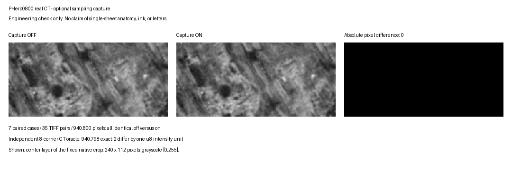

# Final sampling-grid capture: retained PHerc0800 engineering evidence

This is an AI-assisted draft contribution. Human-written relevance commentary
and personal code/evidence review remain pending; publication is not a claim
that those contribution requirements are fulfilled. No ink or letters recovered.

## What the evidence demonstrates

At Villa base `18a2eb10470f06487d8fe2168830c219d19d9cae` plus the frozen C04
capture change, the full Linux amd64 renderer was built and run on a retained
public PHerc0800 CT crop. Seven fixed capture-off/on cases preserve all **35 TIFF
files byte-for-byte and all 940,800 pixels**. This toggles instrumentation in the
same patched binary, not an unpatched-vs-patched or performance comparison.



The figure shows the center TIFF of the native case, grayscale [0,255].
The independent float64 eight-corner CT oracle matches 940,798 pixels exactly;
two differ by one uint8 unit, within the predeclared tolerance of one. Capture
off/on equality itself has zero tolerance. These checks are not a general proof
of renderer correctness or better image quality.

Cases: native, normal flip, max accumulation, two bands, affine translation,
level-one and segmentation scaling. Normal flip reverses the exact TIFF stack;
accumulation retains actual offsets [-2,2.5]; the two-band capture spans all 240
rows across the 128-row seam. Ten unsupported-mode/bounds refusals pass. A
deliberate mask control preserves 97 invalid rays; the Python reader rejects it.

## Pins and provenance

- Raw retained CT: uint8, ZYX 512 x 384 x 384, 8.64 micrometers;
  native origin ZYX [11136,5760,3200].
- Raw SHA-256: `6742370c2e072521d3f31b7a6a660a20a750800441646c6575506556a8485783`.
- Research chart SHA-256: `03159c034bbc32f8a023e7b8f1912d1879bbd64c9ccd662a01bf407ff3982abd`.
- Linked renderer SHA-256: `fa903e43d56aff20f07449884adcbf85d13879f8517da1fe0eb31e2c2e428707`.
- Original capture patch SHA-256:
  `f7bf1263887e94929fd4594dcac04d2b6851150d648f9ff9706e33ca136502a6`.
- GCC 15.2, Linux amd64, QuickBuild -O1, real OpenMP; no fast-math.
- Dependency pins: vc_delta3d `eedd0e62d988bcf97fbaee4ebb7af026f52ca49a`,
  libigl `ae8f959ea26d7059abad4c698aba8d6b7c3205e8` plus Villa's overlay,
  libbacktrace `0b9b49cf4a2c9229fc052d6716e1528b2f23e91a`.

The chart was converted to TIFXYZ with explicit crop-coordinate translation;
the renderer generated directions. Its anatomical sheet identity is unverified.
Level one is an engineering decimation [::2,::2,::2], not the official pyramid.

[Per-case TIFF and array hashes](real-ct-results.json),
[final controls](final-controls.json),
[original full-renderer verification](original-renderer-verification.json),
[actual renderer argument vectors](renderer-commands.json),
[original registered CTest output](capture-ctest.txt),
[portable-package verification](portable-verification.json).

Renderer arguments are extracted verbatim from the retained container commands;
host mount paths are omitted explicitly. Original complete-command receipts are
hash-bound in renderer-commands.json. This evidence selection contains no raw CT
volume, model weights, credentials or local user-home paths. It is **not** a
self-contained end-to-end raw-data replay archive.

## Publication rebase and checks

The publication branch is based on upstream
`777cb16cf9208b35897b231843174f2440d9f1f1`, three commits newer than the full
renderer validation. The capture changes apply to its renderer; test registration
was placed after test_smoke to coexist with new upstream tests. The empty Python
test-package initializer was normalized to zero bytes. No capture or diagnostic
algorithm changed. Original artifacts were not overwritten.

On the publication staging files, **34 Python tests pass** and the identical
dependency-free C++ capture test passes with Apple Clang. See
[publication checks](publication-checks.json) and [Python test output](publication-python-tests.txt).
The full rebased renderer, registered CTest on that rebase, and its CT output
have **not** been rebuilt/replayed. The earlier Linux/CT numbers must not be
presented as measurements of this rebased commit. No full upstream CI or full
macOS renderer build is claimed.

From a checkout with an existing Python and NumPy:

```sh
PYTHONPATH=volume-cartographer/scripts python -m unittest discover -s volume-cartographer/scripts/vc_sampling_audit/tests -v
python volume-cartographer/scripts/vc_sampling_grid_audit.py --help
```

The Python package only needs NumPy; do not install/build the full Villa project
just to run it. See [capture/audit contract](../../scripts/vc_sampling_audit/README.md).

## Limitations and retained corrections

The final vertex rays are actual renderer inputs. Between-pixel geometry is an
explicit affine-triangle diagnostic surrogate, not a certified QuadSurface map.
Zero local failures cannot establish global injectivity, single-sheet anatomy,
CT ink support or letters. Capture is opt-in, report-only and never repairs rays.
Both capture and reader require a bounded grid at least 2 x 2.

An earlier replay driver lacked a TIFF LZW decoder; an already installed Pillow
decoder resolved it without installing anything. Another driver incorrectly
negated the base-chart reference for a global normal flip; correcting the caller
did not change the renderer, inputs or thresholds. These were our driver errors,
not additional upstream bugs. Historical failing supplied directions came from
our own construction, not a demonstrated official renderer normal defect.

This contribution is separate from prior base-Jacobian/surface-to-volume preflight
work. The bounded August-cutoff comparison does not establish exhaustive novelty
or bind the exact mutable-branch artifact at the original submission time.
Independent practical adoption and a prize-ready result are not established.
